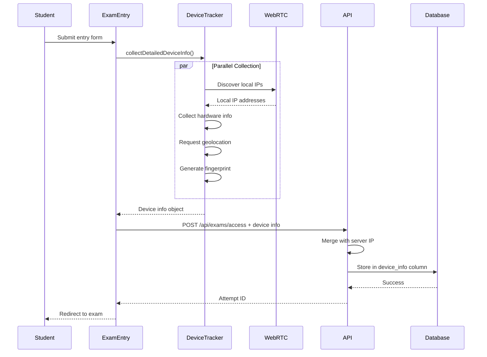

# Design Document: Enhanced Device Tracking

## Overview

This design enhances the exam application's device tracking capabilities to capture comprehensive device information including actual device IP addresses (not router IPs), complete hardware specifications, browser details, and security indicators. The enhancement builds upon the existing `collectDeviceInfo.ts` module and integrates WebRTC-based IP discovery to obtain local device IPs.

The key improvements are:
1. **WebRTC IP Discovery**: Capture actual device local IP addresses using ICE candidate gathering
2. **Enhanced Data Collection**: Fill gaps in browser, platform, hardware, and device model detection
3. **Improved Admin Visibility**: Display complete device information in the admin interface
4. **Backward Compatibility**: Maintain existing database schema and API contracts

## Architecture

### High-Level Flow

```
┌─────────────────┐
│  Student Entry  │
│      Form       │
└────────┬────────┘
         │
         ▼
┌─────────────────────────────────────┐
│  collectDetailedDeviceInfo()        │
│  ┌──────────────────────────────┐  │
│  │ 1. WebRTC IP Discovery       │  │
│  │ 2. User-Agent Client Hints   │  │
│  │ 3. Hardware Info Collection  │  │
│  │ 4. Geolocation Request       │  │
│  │ 5. Network/Battery APIs      │  │
│  │ 6. Canvas Fingerprint        │  │
│  └──────────────────────────────┘  │
└────────┬────────────────────────────┘
         │
         ▼
┌─────────────────┐
│  POST /api/     │
│  exams/access   │
└────────┬────────┘
         │
         ▼
┌─────────────────────────────────────┐
│  Server Processing                  │
│  ┌──────────────────────────────┐  │
│  │ 1. Merge client device info  │  │
│  │ 2. Add server-detected IP    │  │
│  │ 3. Validate & sanitize       │  │
│  │ 4. Store in device_info      │  │
│  └──────────────────────────────┘  │
└────────┬────────────────────────────┘
         │
         ▼
┌─────────────────┐
│   Database      │
│  exam_attempts  │
│  device_info    │
└─────────────────┘
```

### Component Interaction



## Components and Interfaces

### 1. WebRTC IP Discovery Module

**New File**: `src/lib/webrtcIpDiscovery.ts`

```typescript
export interface DiscoveredIP {
  ip: string;
  type: 'local' | 'public';
  family: 'IPv4' | 'IPv6';
  source: 'webrtc';
}

export interface IPDiscoveryResult {
  ips: DiscoveredIP[];
  error: string | null;
  completedAt: string;
}

/**
 * Discovers local and public IP addresses using WebRTC ICE candidates
 * Uses STUN servers to gather ICE candidates and extracts IP addresses
 * 
 * @param timeout - Maximum time to wait for IP discovery (default: 5000ms)
 * @returns Promise resolving to discovered IPs and any errors
 */
export async function discoverIPs(timeout: number = 5000): Promise<IPDiscoveryResult>
```

**Implementation Strategy**:
- Create RTCPeerConnection with public STUN servers (e.g., `stun:stun.l.google.com:19302`)
- Create a dummy data channel to trigger ICE gathering
- Listen for `onicecandidate` events
- Parse candidate strings to extract IP addresses
- Filter candidates by type (host = local, srflx = public)
- Set timeout to prevent hanging
- Clean up connection after gathering

**ICE Candidate Parsing**:
ICE candidates contain IP information in this format:
```
candidate:842163049 1 udp 1677729535 192.168.1.5 58678 typ srflx
```
- Extract IP using regex: `/([0-9]{1,3}(\.[0-9]{1,3}){3}|[a-f0-9]{1,4}(:[a-f0-9]{1,4}){7})/`
- Determine type from `typ` field: `host` (local), `srflx` (server reflexive/public)
- Determine family from IP format (IPv4 vs IPv6)

### 2. Enhanced Device Info Collector

**Modified File**: `src/lib/collectDeviceInfo.ts`

**Enhanced Interface**:
```typescript
export interface EnhancedDeviceInfo {
  // Existing fields (maintained for compatibility)
  collectedAt: string;
  friendlyName: string;
  fingerprint: string | null;
  location: GeolocationData;
  security: SecurityInfo;
  userAgent: string | null;
  platform: string | null;
  language: string | null;
  languages: string[] | null;
  vendor: string | null;
  deviceMemory: number | null;
  hardwareConcurrency: number | null;
  pixelRatio: number | null;
  timezone: string | null;
  timezoneOffset: number;
  touch: boolean;
  screen: ScreenInfo;
  viewport: ViewportInfo;
  parsed: ParsedUA;
  oem: OEMInfo;
  network: NetworkInfo | null;
  battery: BatteryInfo | null;
  gpu: GpuInfo | null;
  
  // New fields
  ips: IPDiscoveryResult;  // WebRTC-discovered IPs
  clientHints: ClientHintsInfo | null;  // User-Agent Client Hints
  browserDetails: BrowserDetails;  // Enhanced browser info
  platformDetails: PlatformDetails;  // Enhanced platform info
}

export interface ClientHintsInfo {
  architecture: string | null;
  bitness: string | null;
  model: string | null;
  platform: string | null;
  platformVersion: string | null;
  uaFullVersion: string | null;
  mobile: boolean | null;
  brands: Array<{ brand: string; version: string }> | null;
}

export interface BrowserDetails {
  name: string | null;
  version: string | null;
  fullVersion: string | null;
  engine: string | null;
  engineVersion: string | null;
}

export interface PlatformDetails {
  os: string | null;
  osVersion: string | null;
  architecture: string | null;
  bitness: string | null;
}
```

**Enhanced Collection Logic**:

1. **WebRTC IP Discovery** (new):
   ```typescript
   const ipDiscovery = await discoverIPs(5000);
   ```

2. **User-Agent Client Hints** (enhanced):
   ```typescript
   let clientHints: ClientHintsInfo | null = null;
   if (nav.userAgentData?.getHighEntropyValues) {
     try {
       const hints = await nav.userAgentData.getHighEntropyValues([
         'architecture',
         'bitness',
         'model',
         'platform',
         'platformVersion',
         'uaFullVersion'
       ]);
       clientHints = {
         architecture: hints.architecture ?? null,
         bitness: hints.bitness ?? null,
         model: hints.model ?? null,
         platform: hints.platform ?? null,
         platformVersion: hints.platformVersion ?? null,
         uaFullVersion: hints.uaFullVersion ?? null,
         mobile: nav.userAgentData.mobile ?? null,
         brands: nav.userAgentData.brands ?? null
       };
     } catch (e) {
       console.warn('Client Hints not available:', e);
     }
   }
   ```

3. **Enhanced Browser Detection** (improved):
   - Parse User-Agent for browser name/version
   - Use Client Hints `uaFullVersion` when available
   - Detect rendering engine (Blink, Gecko, WebKit)
   - Extract engine version from UA string

4. **Enhanced Platform Detection** (improved):
   - Use Client Hints for OS version, architecture, bitness
   - Fall back to UA parsing for non-Chromium browsers
   - Improve Windows version detection (Windows 10 vs 11)
   - Better macOS version extraction

5. **Device Model Detection** (improved):
   - Prioritize Client Hints `model` field
   - Enhanced regex patterns for Android devices
   - Better iPhone/iPad model detection
   - Improved manufacturer inference

### 3. Server-Side Integration

**Modified File**: `src/app/api/public/exams/[examId]/access/route.ts`

**Enhanced Processing**:
```typescript
export async function POST(req: NextRequest, ctx: { params: Promise<{ examId: string }> }) {
  // ... existing code ...
  
  const body = await req.json().catch(() => ({}));
  const clientDeviceInfo = body?.deviceInfo ?? null;  // From client
  
  // Server-side IP detection (existing)
  const hdrs = await headers();
  const serverIP = getClientIp(hdrs);
  
  // Merge client and server information
  const mergedDeviceInfo = {
    ...clientDeviceInfo,
    serverDetectedIP: serverIP,
    serverDetectedAt: new Date().toISOString(),
    // Ensure we have both local and public IPs
    allIPs: {
      local: clientDeviceInfo?.ips?.ips?.filter(ip => ip.type === 'local') ?? [],
      public: clientDeviceInfo?.ips?.ips?.filter(ip => ip.type === 'public') ?? [],
      server: serverIP
    }
  };
  
  // ... start attempt ...
  
  // Store enhanced device info
  if (mergedDeviceInfo) {
    try {
      await supabase
        .from("exam_attempts")
        .update({ 
          device_info: JSON.stringify(mergedDeviceInfo),
          ip_address: serverIP  // Maintain backward compatibility
        })
        .eq("id", attemptId);
    } catch (e) {
      console.warn("device_info update failed", e);
    }
  }
}
```

### 4. Admin Interface Updates

**Modified Files**: 
- `src/app/admin/results/[attemptId]/page.tsx`
- `src/app/admin/results/page.tsx`

**Display Enhancements**:

1. **IP Address Display**:
   ```typescript
   // Show both local and public IPs
   const localIPs = deviceInfo?.allIPs?.local ?? [];
   const publicIPs = deviceInfo?.allIPs?.public ?? [];
   const serverIP = deviceInfo?.serverDetectedIP ?? deviceInfo?.allIPs?.server;
   
   <div>
     <h4>IP Addresses</h4>
     {localIPs.length > 0 && (
       <div>
         <strong>Local IPs:</strong>
         {localIPs.map(ip => <span key={ip.ip}>{ip.ip} ({ip.family})</span>)}
       </div>
     )}
     {publicIPs.length > 0 && (
       <div>
         <strong>Public IPs:</strong>
         {publicIPs.map(ip => <span key={ip.ip}>{ip.ip} ({ip.family})</span>)}
       </div>
     )}
     <div>
       <strong>Server-Detected IP:</strong> {serverIP}
     </div>
   </div>
   ```

2. **Device Information Sections**:
   - **Browser**: Name, version, engine (from enhanced detection)
   - **Platform**: OS, version, architecture, bitness
   - **Hardware**: CPU cores, RAM, screen, GPU
   - **Device**: Manufacturer, model, friendly name
   - **Network**: Connection type, speed, RTT
   - **Security**: Automation risk, webdriver, plugins
   - **Location**: Coordinates, timezone, language

3. **Visual Indicators**:
   - Red badge for high automation risk
   - Yellow badge for missing device info
   - Green badge for complete information
   - Icon indicators for device type (mobile/tablet/desktop)

## Data Models

### Device Info JSON Structure

```json
{
  "collectedAt": "2025-02-06T10:30:00.000Z",
  "friendlyName": "Samsung Galaxy S21 (Android 13) Chrome 120",
  
  "ips": {
    "ips": [
      {
        "ip": "192.168.1.105",
        "type": "local",
        "family": "IPv4",
        "source": "webrtc"
      },
      {
        "ip": "2001:0db8:85a3::8a2e:0370:7334",
        "type": "local",
        "family": "IPv6",
        "source": "webrtc"
      }
    ],
    "error": null,
    "completedAt": "2025-02-06T10:30:01.234Z"
  },
  
  "allIPs": {
    "local": [
      { "ip": "192.168.1.105", "type": "local", "family": "IPv4", "source": "webrtc" }
    ],
    "public": [],
    "server": "203.0.113.45"
  },
  
  "serverDetectedIP": "203.0.113.45",
  "serverDetectedAt": "2025-02-06T10:30:02.000Z",
  
  "browserDetails": {
    "name": "Chrome",
    "version": "120",
    "fullVersion": "120.0.6099.129",
    "engine": "Blink",
    "engineVersion": "120.0.6099.129"
  },
  
  "platformDetails": {
    "os": "Android",
    "osVersion": "13",
    "architecture": "arm",
    "bitness": "64"
  },
  
  "clientHints": {
    "architecture": "arm",
    "bitness": "64",
    "model": "SM-G991B",
    "platform": "Android",
    "platformVersion": "13.0.0",
    "uaFullVersion": "120.0.6099.129",
    "mobile": true,
    "brands": [
      { "brand": "Google Chrome", "version": "120" },
      { "brand": "Chromium", "version": "120" }
    ]
  },
  
  "oem": {
    "brand": "Samsung",
    "model": "SM-G991B",
    "source": "ua-ch"
  },
  
  "hardware": {
    "deviceMemory": 8,
    "hardwareConcurrency": 8,
    "screen": {
      "width": 1080,
      "height": 2400,
      "colorDepth": 24,
      "pixelDepth": 24
    },
    "viewport": {
      "width": 412,
      "height": 915
    },
    "pixelRatio": 2.625,
    "touch": true,
    "maxTouchPoints": 5
  },
  
  "gpu": {
    "vendor": "ARM",
    "renderer": "Mali-G78"
  },
  
  "network": {
    "type": "cellular",
    "effectiveType": "4g",
    "downlink": 10,
    "rtt": 50,
    "saveData": false
  },
  
  "battery": {
    "level": 75,
    "charging": false
  },
  
  "location": {
    "latitude": 30.0444,
    "longitude": 31.2357,
    "accuracy": 20,
    "timestamp": 1707217800000,
    "error": null
  },
  
  "security": {
    "webdriver": false,
    "pdfViewer": true,
    "doNotTrack": false,
    "pluginsCount": 3,
    "cookiesEnabled": true,
    "isExtended": false,
    "maxTouchPoints": 5,
    "automationRisk": false
  },
  
  "locale": {
    "timezone": "Africa/Cairo",
    "timezoneOffset": -120,
    "language": "ar",
    "languages": ["ar", "en"],
    "vendor": "Google Inc."
  },
  
  "fingerprint": "a3f5b8c2d1e4",
  
  "userAgent": "Mozilla/5.0 (Linux; Android 13; SM-G991B) AppleWebKit/537.36...",
  "platform": "Linux armv8l"
}
```

### Database Schema

**No changes required** - the existing `device_info` JSONB column can store the enhanced structure.

```sql
-- Existing schema (no modifications needed)
CREATE TABLE exam_attempts (
  id uuid PRIMARY KEY,
  exam_id uuid NOT NULL,
  student_id uuid,
  ip_address inet,  -- Maintained for backward compatibility
  device_info jsonb,  -- Stores enhanced JSON structure
  -- ... other fields
);

-- Optional: Add index for IP queries
CREATE INDEX IF NOT EXISTS idx_device_info_ips 
ON exam_attempts USING gin ((device_info->'allIPs'));

-- Optional: Add index for fingerprint queries
CREATE INDEX IF NOT EXISTS idx_device_info_fingerprint 
ON exam_attempts ((device_info->>'fingerprint'));
```

## Correctness Properties

*A property is a characteristic or behavior that should hold true across all valid executions of a system—essentially, a formal statement about what the system should do. Properties serve as the bridge between human-readable specifications and machine-verifiable correctness guarantees.*


### Property Reflection

After analyzing all acceptance criteria, I've identified the following consolidations to eliminate redundancy:

**Consolidations:**
1. Properties 3.1-3.6 (hardware capture) can be combined into one comprehensive property about hardware data collection
2. Properties 5.1-5.3 (geolocation, network, battery) can be combined into one property about optional API data collection
3. Properties 6.1-6.3 (security indicators) can be combined with 6.4-6.5 (risk calculation) into one comprehensive security property
4. Properties 8.1-8.4 (data storage structure) can be combined into one property about JSON structure validation
5. Properties 2.1-2.2 (browser and OS extraction) are both UA parsing and can be combined
6. Properties 4.1-4.3 (device model detection) can be combined into one property about model extraction

**Retained as separate:**
- IP discovery properties (1.1-1.5) - each tests different aspects of the WebRTC flow
- Fingerprint properties (7.1-7.4) - each tests different stages of fingerprinting
- Integration properties (9.1-9.5) - each tests different integration requirements
- UI properties (10.1-10.5) - these are examples, not properties

### Correctness Properties

Property 1: WebRTC IP Discovery Attempt
*For any* exam attempt, when device info is collected, the result should contain an ips field with a completedAt timestamp, regardless of whether IP discovery succeeded or failed
**Validates: Requirements 1.1**

Property 2: Complete IP Capture
*For any* successful WebRTC IP discovery, all discovered IP addresses (both IPv4 and IPv6) should be present in the ips array with correct type and family labels
**Validates: Requirements 1.2**

Property 3: IP Discovery Fallback
*For any* device info collection where WebRTC fails, the serverDetectedIP field should still contain a valid IP address from server-side headers
**Validates: Requirements 1.3**

Property 4: IP Persistence
*For any* exam attempt with collected device info containing IP addresses, querying the database should return the same IP addresses in the device_info column
**Validates: Requirements 1.4**

Property 5: IP Discovery Timeout
*For any* IP discovery operation, the function should complete (successfully or with timeout) within 5 seconds
**Validates: Requirements 1.5**

Property 6: User-Agent Parsing Completeness
*For any* valid user agent string, the parsed result should contain both browser information (name, version) and operating system information (name, version)
**Validates: Requirements 2.1, 2.2**

Property 7: Client Hints Utilization
*For any* browser environment where navigator.userAgentData.getHighEntropyValues is available, the collected device info should contain a non-null clientHints field with platform details
**Validates: Requirements 2.3**

Property 8: Device Type Classification
*For any* collected device info, the device type should be exactly one of: 'mobile', 'tablet', 'desktop', or 'unknown'
**Validates: Requirements 2.4**

Property 9: Structured Data Format
*For any* collected device info, the JSON structure should contain all required top-level fields (collectedAt, browserDetails, platformDetails, hardware, security, locale) with proper nesting
**Validates: Requirements 2.5**

Property 10: Hardware Data Collection
*For any* device info collection, when hardware APIs are available (hardwareConcurrency, deviceMemory, screen, GPU), the corresponding fields should contain numeric or object values (not null)
**Validates: Requirements 3.1, 3.2, 3.3, 3.4, 3.5, 3.6**

Property 11: Device Model Extraction
*For any* device with User-Agent Client Hints support OR recognizable UA patterns, the oem field should contain a non-null brand and model with a valid source indicator ('ua-ch' or 'ua')
**Validates: Requirements 4.1, 4.2, 4.3**

Property 12: Friendly Name Generation
*For any* collected device info, the friendlyName field should be a non-empty string combining available manufacturer, model, OS, and browser information
**Validates: Requirements 4.4**

Property 13: Optional API Data Collection
*For any* device info collection, when optional APIs (Geolocation, Network Information, Battery) are available and permissions granted, the corresponding fields (location, network, battery) should contain valid data objects
**Validates: Requirements 5.1, 5.2, 5.3**

Property 14: Locale Information Capture
*For any* device info collection, the locale object should contain non-null values for timezone, language, and timezoneOffset
**Validates: Requirements 5.4**

Property 15: Graceful Permission Denial
*For any* device info collection where geolocation permission is denied, the collection should complete successfully with location.error field populated and other fields still collected
**Validates: Requirements 5.5**

Property 16: Security Indicators and Risk Assessment
*For any* collected device info, the security object should contain all indicator fields (webdriver, pluginsCount, cookiesEnabled, isExtended) and an automationRisk boolean calculated from these indicators
**Validates: Requirements 6.1, 6.2, 6.3, 6.4, 6.5**

Property 17: Canvas Fingerprint Generation
*For any* browser with canvas support, the fingerprint field should contain a non-null hexadecimal string hash
**Validates: Requirements 7.1, 7.2**

Property 18: Fingerprint Persistence
*For any* exam attempt with a generated fingerprint, storing and then retrieving the attempt should return the same fingerprint value
**Validates: Requirements 7.3**

Property 19: Fingerprint Linking
*For any* fingerprint value, querying all attempts with that fingerprint should return only attempts from the same device (same fingerprint)
**Validates: Requirements 7.4**

Property 20: Complete Data Storage Structure
*For any* device info stored in the database, the JSON should have organized sections (hardware, network, security, location, locale), a collectedAt timestamp, and null values for unavailable fields (not undefined or missing)
**Validates: Requirements 8.1, 8.2, 8.3, 8.4**

Property 21: Backward Compatibility
*For any* existing exam attempt record with old device_info format, reading and displaying the device info should not throw errors or break the admin interface
**Validates: Requirements 8.5**

Property 22: Device Info in API Request
*For any* exam access request, the request body should include a deviceInfo field containing the collected device information
**Validates: Requirements 9.2**

Property 23: Collection Timeout
*For any* device info collection, the operation should complete within 10 seconds, returning either complete or partial data
**Validates: Requirements 9.3**

Property 24: Non-Blocking Collection
*For any* exam access request, even if device info collection completely fails (returns null), the exam attempt should still be created successfully
**Validates: Requirements 9.4**

Property 25: Error Logging
*For any* device info collection error, the error should be logged to the browser console with sufficient detail for debugging
**Validates: Requirements 9.5**

Property 26: Null Data Handling in UI
*For any* attempt with null or incomplete device_info, the admin interface should render without errors and display "Unknown" or placeholder values for missing fields
**Validates: Requirements 10.5**

## Error Handling

### Client-Side Error Handling

1. **WebRTC Not Supported**:
   - Check for `RTCPeerConnection` availability
   - Return empty IPs array with error message
   - Continue with other collection

2. **WebRTC Timeout**:
   - Set 5-second timeout on ICE gathering
   - Close connection and return partial results
   - Log timeout to console

3. **Permission Denials**:
   - Geolocation: Store error in location.error field
   - Continue with other collection
   - Don't retry or prompt again

4. **API Unavailability**:
   - Check for API existence before calling
   - Use null for unavailable data
   - Don't throw errors for missing APIs

5. **Canvas Fingerprint Failure**:
   - Wrap in try-catch
   - Return null fingerprint
   - Log error but continue

6. **Overall Collection Timeout**:
   - Set 10-second maximum for entire collection
   - Return partial data if timeout reached
   - Include timeout indicator in result

### Server-Side Error Handling

1. **Invalid Device Info JSON**:
   - Validate JSON structure
   - Log validation errors
   - Store null if invalid
   - Don't fail attempt creation

2. **Database Storage Failure**:
   - Wrap device_info update in try-catch
   - Log error with attempt ID
   - Continue with attempt creation
   - Device info is supplementary, not critical

3. **Missing Device Info**:
   - Handle null deviceInfo in request body
   - Create attempt with null device_info
   - Store only server-detected IP

### Admin Interface Error Handling

1. **Null Device Info**:
   - Check for null before accessing fields
   - Display "No device information" message
   - Show only server IP if available

2. **Malformed Device Info**:
   - Wrap JSON parsing in try-catch
   - Display raw JSON view as fallback
   - Show error message to admin

3. **Missing Fields**:
   - Use optional chaining (?.) for all field access
   - Provide default values ("Unknown", null, [])
   - Don't break rendering for missing data

## Testing Strategy

### Unit Testing

**Test Files**:
- `src/lib/__tests__/webrtcIpDiscovery.test.ts` - WebRTC IP discovery logic
- `src/lib/__tests__/collectDeviceInfo.enhanced.test.ts` - Enhanced device collection
- `src/lib/__tests__/deviceInfoParsing.test.ts` - UA parsing and Client Hints

**Unit Test Focus**:
- Specific examples of UA strings and expected parsing results
- Edge cases: empty UA, malformed UA, unusual device models
- Error conditions: API unavailable, permission denied, timeout
- Integration points: merging client and server data

**Example Unit Tests**:
```typescript
describe('WebRTC IP Discovery', () => {
  it('should parse IPv4 addresses from ICE candidates', () => {
    const candidate = 'candidate:842163049 1 udp 1677729535 192.168.1.5 58678 typ host';
    const ip = parseICECandidate(candidate);
    expect(ip).toEqual({
      ip: '192.168.1.5',
      type: 'local',
      family: 'IPv4',
      source: 'webrtc'
    });
  });

  it('should handle WebRTC timeout gracefully', async () => {
    const result = await discoverIPs(100); // Very short timeout
    expect(result.completedAt).toBeDefined();
    expect(result.error).toContain('timeout');
  });
});

describe('User-Agent Parsing', () => {
  it('should extract Samsung device model from UA', () => {
    const ua = 'Mozilla/5.0 (Linux; Android 13; SM-G991B) AppleWebKit/537.36...';
    const parsed = parseUserAgent(ua);
    expect(parsed.manufacturer).toBe('Samsung');
    expect(parsed.model).toBe('SM-G991B');
  });

  it('should handle unknown devices gracefully', () => {
    const ua = 'UnknownBrowser/1.0';
    const parsed = parseUserAgent(ua);
    expect(parsed.manufacturer).toBe('Unknown');
    expect(parsed.model).toBe('Unknown');
  });
});
```

### Property-Based Testing

**Test Files**:
- `src/lib/__tests__/deviceInfo.pbt.test.ts` - Property tests for device collection
- `src/lib/__tests__/ipDiscovery.pbt.test.ts` - Property tests for IP discovery

**Property Test Configuration**:
- Minimum 100 iterations per test
- Use fast-check library for TypeScript
- Tag each test with feature name and property number

**Example Property Tests**:
```typescript
import fc from 'fast-check';

describe('Property Tests: Enhanced Device Tracking', () => {
  it('Property 8: Device Type Classification', () => {
    fc.assert(
      fc.property(
        fc.string(), // Random user agent
        (userAgent) => {
          const deviceInfo = parseUserAgent(userAgent);
          const validTypes = ['mobile', 'tablet', 'desktop', 'unknown'];
          expect(validTypes).toContain(deviceInfo.type);
        }
      ),
      { numRuns: 100 }
    );
    // Feature: enhanced-device-tracking, Property 8: Device type should be one of four valid values
  });

  it('Property 12: Friendly Name Generation', () => {
    fc.assert(
      fc.property(
        fc.record({
          manufacturer: fc.option(fc.string(), { nil: null }),
          model: fc.option(fc.string(), { nil: null }),
          os: fc.option(fc.string(), { nil: null }),
          browser: fc.option(fc.string(), { nil: null })
        }),
        (deviceParts) => {
          const friendlyName = generateFriendlyName(deviceParts);
          expect(friendlyName).toBeTruthy();
          expect(typeof friendlyName).toBe('string');
          expect(friendlyName.length).toBeGreaterThan(0);
        }
      ),
      { numRuns: 100 }
    );
    // Feature: enhanced-device-tracking, Property 12: Friendly name should always be non-empty string
  });

  it('Property 20: Complete Data Storage Structure', () => {
    fc.assert(
      fc.property(
        fc.anything(), // Random device info
        async (mockDeviceInfo) => {
          const collected = await collectDetailedDeviceInfo();
          
          // Check required sections exist
          expect(collected).toHaveProperty('hardware');
          expect(collected).toHaveProperty('network');
          expect(collected).toHaveProperty('security');
          expect(collected).toHaveProperty('location');
          expect(collected).toHaveProperty('locale');
          expect(collected).toHaveProperty('collectedAt');
          
          // Check null values (not undefined)
          const checkNullNotUndefined = (obj: any) => {
            for (const key in obj) {
              expect(obj[key]).not.toBe(undefined);
            }
          };
          checkNullNotUndefined(collected);
        }
      ),
      { numRuns: 100 }
    );
    // Feature: enhanced-device-tracking, Property 20: JSON structure should have all sections with null (not undefined) for unavailable data
  });
});
```

### Integration Testing

**Test Scenarios**:
1. **End-to-End Device Collection**:
   - Start exam attempt
   - Verify device info collected
   - Verify stored in database
   - Verify displayed in admin interface

2. **WebRTC IP Discovery Flow**:
   - Mock RTCPeerConnection
   - Trigger ICE candidate events
   - Verify IPs extracted and stored

3. **Client Hints Integration**:
   - Mock navigator.userAgentData
   - Verify high entropy values requested
   - Verify data merged into device info

4. **Server-Side Merging**:
   - Send client device info to API
   - Verify server IP added
   - Verify merged data stored

### Browser Compatibility Testing

**Test Matrix**:
- Chrome/Edge (Chromium): Full support including Client Hints
- Firefox: UA parsing only, no Client Hints
- Safari: UA parsing, limited WebRTC
- Mobile browsers: iOS Safari, Chrome Mobile, Samsung Internet

**Compatibility Checks**:
- WebRTC availability
- Client Hints API availability
- Geolocation API
- Network Information API
- Battery API (deprecated in some browsers)

### Performance Testing

**Metrics**:
- Device collection time: Should complete in < 10 seconds
- IP discovery time: Should complete in < 5 seconds
- Database storage time: Should be < 100ms
- Admin interface render time: Should handle large device info < 1 second

**Load Testing**:
- 100 concurrent exam starts with device collection
- Verify no timeouts or failures
- Verify database performance with large device_info JSON

## Implementation Notes

### Browser API Availability

**User-Agent Client Hints**:
- Only available in Chromium browsers (Chrome, Edge, Opera)
- Requires HTTPS in production
- Not available in Firefox, Safari

**WebRTC**:
- Widely supported but can be blocked by browser settings
- May be disabled in privacy-focused browsers
- Requires HTTPS for some features

**Network Information API**:
- Limited browser support
- Experimental in some browsers
- May not be available on desktop

**Battery API**:
- Deprecated in many browsers for privacy reasons
- May return null even if API exists
- Should not be relied upon

### Privacy Considerations

1. **Geolocation**:
   - Requires explicit user permission
   - Should explain why location is requested
   - Don't block exam if denied

2. **Fingerprinting**:
   - Canvas fingerprinting may be blocked by privacy extensions
   - Should not be used as sole identifier
   - Combine with other signals

3. **IP Addresses**:
   - Local IPs may reveal network topology
   - Store securely and limit access
   - Comply with data protection regulations

4. **Data Retention**:
   - Consider retention policies for device data
   - Allow deletion of old device info
   - Anonymize data when possible

### Security Considerations

1. **Input Validation**:
   - Validate all device info on server
   - Sanitize strings to prevent injection
   - Limit JSON size to prevent DoS

2. **Data Storage**:
   - Encrypt device_info at rest
   - Limit admin access to device data
   - Audit access to sensitive information

3. **Client-Side Collection**:
   - Don't trust client-provided data completely
   - Verify critical data server-side
   - Use server IP as source of truth

### Deployment Considerations

1. **Gradual Rollout**:
   - Deploy enhanced collection alongside existing
   - Monitor for errors and performance issues
   - Fall back to basic collection if needed

2. **Database Migration**:
   - No schema changes required
   - Existing records remain valid
   - New fields added to new attempts

3. **Admin Interface Updates**:
   - Handle both old and new device info formats
   - Provide migration path for displaying old data
   - Add feature flags for new UI sections

4. **Monitoring**:
   - Track device collection success rate
   - Monitor WebRTC discovery success rate
   - Alert on high failure rates
   - Log collection errors for analysis
