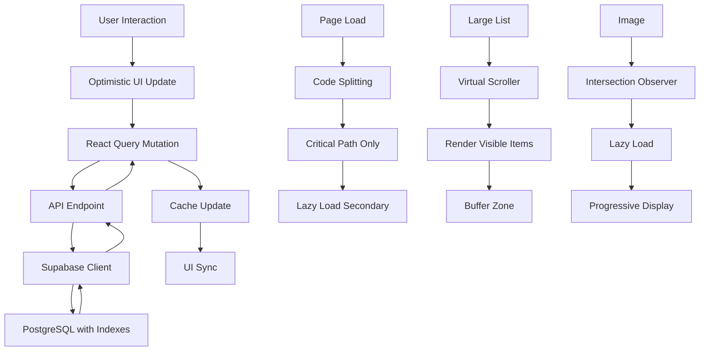

# Design Document: Performance Optimization and Backend Fixes

## Overview

This design document outlines a comprehensive performance optimization strategy for the Advanced Exam Application. The optimizations target both frontend and backend performance, focusing on six key areas: list virtualization, image lazy loading, optimistic UI updates, code splitting, backend query optimization, and measurable performance metrics.

The implementation will leverage modern React patterns, Next.js 15 capabilities, and Supabase's performance features to deliver a significantly faster and more responsive user experience. All optimizations maintain backward compatibility and follow the existing architecture patterns.

### Goals

- Reduce initial page load time to under 2 seconds
- Achieve smooth 60 FPS scrolling for large lists
- Minimize Cumulative Layout Shift (CLS) to below 0.1
- Reduce bundle size by at least 30% through code splitting
- Optimize database queries to complete within 500ms (95th percentile)
- Provide immediate UI feedback through optimistic updates

### Non-Goals

- Changing the fundamental architecture or tech stack
- Migrating away from Node.js 20 runtime
- Rewriting existing components from scratch
- Adding new features beyond performance improvements

## Architecture

### High-Level Architecture

The performance optimizations follow a layered approach:

1. **Presentation Layer**: Virtualized lists, lazy-loaded images, optimistic UI
2. **Data Layer**: React Query with optimistic updates and intelligent caching
3. **Network Layer**: Code splitting, bundle optimization, preloading
4. **Backend Layer**: Query optimization, index improvements, RLS policy tuning

### Component Interaction




## Components and Interfaces

### 1. List Virtualization Components

#### VirtualizedList Component

A reusable virtualization wrapper that renders only visible items plus a buffer zone.

**Interface:**
```typescript
interface VirtualizedListProps<T> {
  items: T[];
  itemHeight: number | ((item: T, index: number) => number);
  renderItem: (item: T, index: number) => React.ReactNode;
  overscan?: number; // Buffer items above/below viewport (default: 5)
  onScroll?: (scrollTop: number) => void;
  className?: string;
  estimatedItemHeight?: number; // For dynamic heights
  scrollRestoration?: boolean; // Enable scroll position restoration
}
```

**Implementation Strategy:**
- Use `react-window` or `@tanstack/react-virtual` library for robust virtualization
- Support both fixed and dynamic item heights
- Implement scroll position restoration using sessionStorage
- Maintain 60 FPS performance through requestAnimationFrame
- Handle resize events to recalculate visible range

**Target Components:**
- `src/app/admin/exams/page.tsx` - Exam list table
- `src/app/admin/results/page.tsx` - Results table and student lists
- `src/app/admin/audit/page.tsx` - Audit log table
- `src/app/admin/students/page.tsx` - Student list
- Question list in exam editor

### 2. Image Lazy Loading Components

#### LazyImage Component

A drop-in replacement for Next.js Image component with enhanced lazy loading.

**Interface:**
```typescript
interface LazyImageProps {
  src: string;
  alt: string;
  width?: number;
  height?: number;
  aspectRatio?: string; // e.g., "16/9" to prevent layout shift
  className?: string;
  fallback?: React.ReactNode;
  skeleton?: boolean; // Show skeleton during load
  threshold?: number; // Intersection threshold in pixels (default: 200)
  onLoad?: () => void;
  onError?: (error: Error) => void;
}
```

**Implementation Strategy:**
- Use Intersection Observer API for viewport detection
- Reserve space using aspect ratio to prevent CLS
- Display skeleton placeholder during loading
- Implement progressive image loading for large images (blur-up technique)
- Handle error states with fallback UI
- Log errors for monitoring

**Target Images:**
- Student photos in results and monitoring pages
- Exam question images
- Logo uploads in settings
- Any user-uploaded content


### 3. Optimistic UI Update System

#### React Query Configuration

Enhanced React Query setup with optimistic updates for all mutations.

**Configuration:**
```typescript
interface OptimisticMutationOptions<TData, TVariables> {
  mutationFn: (variables: TVariables) => Promise<TData>;
  onMutate?: (variables: TVariables) => Promise<{ previousData: any }>;
  onError?: (error: Error, variables: TVariables, context: any) => void;
  onSuccess?: (data: TData, variables: TVariables, context: any) => void;
  onSettled?: () => void;
}
```

**Implementation Strategy:**
- Configure React Query with optimistic update patterns
- Implement rollback mechanism on mutation failure
- Show subtle loading indicators during pending operations
- Queue multiple operations without blocking UI
- Maintain data consistency through proper cache invalidation

**Target Operations:**
- Exam saves and updates
- Question creation, updates, and reordering
- Student information edits
- Attempt submissions
- Settings updates

#### Optimistic Update Pattern

```typescript
// Example pattern for exam updates
const updateExamMutation = useMutation({
  mutationFn: (exam: Exam) => authFetch(`/api/admin/exams/${exam.id}`, {
    method: 'PATCH',
    body: JSON.stringify(exam)
  }),
  onMutate: async (newExam) => {
    // Cancel outgoing refetches
    await queryClient.cancelQueries({ queryKey: ['admin', 'exams'] });
    
    // Snapshot previous value
    const previousExams = queryClient.getQueryData(['admin', 'exams']);
    
    // Optimistically update cache
    queryClient.setQueryData(['admin', 'exams'], (old: any) => ({
      ...old,
      items: old.items.map((e: Exam) => 
        e.id === newExam.id ? newExam : e
      )
    }));
    
    return { previousExams };
  },
  onError: (err, newExam, context) => {
    // Rollback on error
    queryClient.setQueryData(['admin', 'exams'], context?.previousExams);
    toast.error({ title: 'Update Failed', message: err.message });
  },
  onSettled: () => {
    // Refetch to ensure consistency
    queryClient.invalidateQueries({ queryKey: ['admin', 'exams'] });
  }
});
```

### 4. Code Splitting Architecture

#### Dynamic Import Strategy

Implement strategic code splitting to reduce initial bundle size.

**Split Points:**
1. **Route-based splitting** (automatic with Next.js App Router)
2. **Component-based splitting** for heavy components
3. **Library splitting** for large dependencies

**Implementation:**

```typescript
// Lazy load heavy components
const ChartComponent = dynamic(() => import('@/components/ChartComponent'), {
  loading: () => <ChartSkeleton />,
  ssr: false // Client-only for chart libraries
});

const ExcelExport = dynamic(() => import('@/lib/excelExport'), {
  loading: () => <span>Preparing export...</span>
});

// Lazy load question type components
const QuestionTypeComponents = {
  'multiple-choice': dynamic(() => import('@/components/questions/MultipleChoice')),
  'short-answer': dynamic(() => import('@/components/questions/ShortAnswer')),
  'paragraph': dynamic(() => import('@/components/questions/Paragraph')),
  // ... other types
};
```

**Target Components for Lazy Loading:**
- Chart.js and react-chartjs-2 (analytics pages)
- XLSX library (export functionality)
- jsPDF (PDF generation)
- React Quill (rich text editor)
- QR code generation
- Modal dialogs
- Question type components


#### Bundle Optimization Techniques

**1. Font Optimization:**
```typescript
// next.config.ts
export default {
  // ... other config
  experimental: {
    optimizeFonts: true,
  },
};

// Use font-display: swap for Tajawal font
// Preload critical fonts in layout.tsx
```

**2. Preloading Strategy:**
```typescript
// Preload critical resources during idle time
useEffect(() => {
  if ('requestIdleCallback' in window) {
    requestIdleCallback(() => {
      // Preload likely next routes
      router.prefetch('/admin/results');
      router.prefetch('/admin/monitoring');
    });
  }
}, []);
```

**3. Tree Shaking:**
- Ensure all imports use named imports where possible
- Remove unused dependencies
- Configure webpack to eliminate dead code

### 5. Backend Performance Optimization

#### Database Query Optimization

**Strategy:**
1. Audit all queries using Supabase MCP tools
2. Add missing indexes for frequently queried columns
3. Optimize RLS policies to minimize overhead
4. Use database views for complex aggregations
5. Implement connection pooling best practices

**Key Optimizations:**

**Index Additions:**
```sql
-- Indexes for exam queries
CREATE INDEX IF NOT EXISTS idx_exams_status ON exams(status) WHERE NOT is_archived;
CREATE INDEX IF NOT EXISTS idx_exams_created_at ON exams(created_at DESC);
CREATE INDEX IF NOT EXISTS idx_exams_start_end ON exams(start_time, end_time) WHERE status = 'published';

-- Indexes for attempt queries
CREATE INDEX IF NOT EXISTS idx_attempts_exam_student ON exam_attempts(exam_id, student_name);
CREATE INDEX IF NOT EXISTS idx_attempts_submitted ON exam_attempts(submitted_at DESC) WHERE submitted_at IS NOT NULL;
CREATE INDEX IF NOT EXISTS idx_attempts_exam_status ON exam_attempts(exam_id, completion_status);

-- Indexes for results queries
CREATE INDEX IF NOT EXISTS idx_results_attempt ON exam_results(attempt_id);
CREATE INDEX IF NOT EXISTS idx_results_score ON exam_results(score_percentage DESC);

-- Indexes for audit logs
CREATE INDEX IF NOT EXISTS idx_audit_created ON audit_logs(created_at DESC);
CREATE INDEX IF NOT EXISTS idx_audit_user ON audit_logs(user_id, created_at DESC);
CREATE INDEX IF NOT EXISTS idx_audit_action ON audit_logs(action, created_at DESC);

-- Indexes for students
CREATE INDEX IF NOT EXISTS idx_students_code ON students(code);
CREATE INDEX IF NOT EXISTS idx_students_name ON students(student_name);
```

**RLS Policy Optimization:**
```sql
-- Optimize RLS policies to use indexes
-- Example: Ensure policies use indexed columns in WHERE clauses
ALTER POLICY "exam_attempts_select" ON exam_attempts
  USING (
    -- Use indexed column first
    exam_id IN (SELECT id FROM exams WHERE status = 'published')
  );
```

**Query Optimization Patterns:**

1. **Batch Queries:** Combine multiple queries into single requests
2. **Selective Fields:** Only fetch required columns
3. **Pagination:** Implement cursor-based pagination for large datasets
4. **Caching:** Use React Query staleTime for appropriate cache duration

```typescript
// Example: Optimized exam list query
const { data } = useQuery({
  queryKey: ['admin', 'exams', 'list'],
  queryFn: async () => {
    const { data, error } = await supabaseClient
      .from('exams')
      .select('id, title, status, created_at, start_time, end_time')
      .order('created_at', { ascending: false })
      .limit(100);
    
    if (error) throw error;
    return data;
  },
  staleTime: 30000, // Cache for 30 seconds
});
```


#### Real-time Subscription Optimization

**Current Issue:** Real-time subscriptions can create overhead if not properly scoped.

**Optimization Strategy:**
```typescript
// Only subscribe to necessary changes
const subscription = supabaseClient
  .channel('exam-monitoring')
  .on(
    'postgres_changes',
    {
      event: 'INSERT',
      schema: 'public',
      table: 'exam_attempts',
      filter: `exam_id=eq.${examId}` // Scope to specific exam
    },
    (payload) => {
      queryClient.invalidateQueries(['monitoring', examId]);
    }
  )
  .subscribe();

// Clean up subscriptions when component unmounts
useEffect(() => {
  return () => {
    subscription.unsubscribe();
  };
}, []);
```

#### API Endpoint Optimization

**Response Time Targets:**
- Simple queries: < 100ms
- Complex aggregations: < 300ms
- Export operations: < 500ms
- 95th percentile: < 500ms for all operations

**Optimization Techniques:**
1. Implement response caching for frequently accessed data
2. Use database views for complex aggregations
3. Optimize JSON serialization
4. Implement request debouncing on client side
5. Use streaming for large exports

## Data Models

### Performance Monitoring Data

```typescript
interface PerformanceMetrics {
  pageLoadTime: number; // milliseconds
  timeToInteractive: number; // milliseconds
  firstContentfulPaint: number; // milliseconds
  cumulativeLayoutShift: number; // score
  scrollFPS: number; // frames per second
  bundleSize: {
    initial: number; // bytes
    total: number; // bytes
  };
  queryMetrics: {
    averageResponseTime: number; // milliseconds
    p95ResponseTime: number; // milliseconds
    slowQueries: Array<{
      query: string;
      duration: number;
    }>;
  };
}
```

### Virtualization State

```typescript
interface VirtualizationState {
  scrollTop: number;
  visibleStartIndex: number;
  visibleEndIndex: number;
  totalHeight: number;
  itemHeights: Map<number, number>; // For dynamic heights
}
```

### Image Loading State

```typescript
interface ImageLoadState {
  status: 'idle' | 'loading' | 'loaded' | 'error';
  src: string;
  error?: Error;
  dimensions?: {
    width: number;
    height: number;
  };
}
```


## Correctness Properties

*A property is a characteristic or behavior that should hold true across all valid executions of a system—essentially, a formal statement about what the system should do. Properties serve as the bridge between human-readable specifications and machine-verifiable correctness guarantees.*

### Property 1: Virtualization Renders Only Visible Items

*For any* list with more than 50 items, when rendered with virtualization, only the visible items plus the configured buffer zone should be present in the DOM.

**Validates: Requirements 1.1, 1.2**

### Property 2: Virtualization Supports Dynamic Heights

*For any* virtualized list containing items with variable content sizes, the virtualization system should correctly calculate and render items with their actual heights without visual glitches.

**Validates: Requirements 1.5**

### Property 3: Scroll Position Restoration

*For any* virtualized list, when a user navigates away and returns to the same list, the scroll position should be restored to within 50 pixels of the previous position.

**Validates: Requirements 1.3**

### Property 4: Lazy Loading Threshold Behavior

*For any* image positioned more than 200 pixels outside the viewport, the image should not begin loading until it comes within the threshold distance.

**Validates: Requirements 2.1, 2.2**

### Property 5: Image Loading Skeleton Display

*For any* image in the loading state, a skeleton placeholder should be visible in the UI until the image completes loading or fails.

**Validates: Requirements 2.3**

### Property 6: Image Error Handling

*For any* image that fails to load, the system should display a fallback placeholder and log the error to the console or monitoring system.

**Validates: Requirements 2.4**

### Property 7: Layout Shift Prevention

*For any* image that loads after initial render, the Cumulative Layout Shift (CLS) contribution should be zero due to reserved space based on aspect ratio.

**Validates: Requirements 2.6**

### Property 8: Optimistic Update Immediate Feedback

*For any* mutation operation (exam save, question update, student edit), the UI should reflect the change immediately before receiving server confirmation.

**Validates: Requirements 3.1, 3.2, 3.3**

### Property 9: Optimistic Update Rollback

*For any* optimistic update that results in a server error, the UI should rollback to the previous state and display an error message to the user.

**Validates: Requirements 3.4**

### Property 10: Loading Indicator During Mutations

*For any* pending mutation operation, a loading indicator should be visible in the UI until the operation completes or fails.

**Validates: Requirements 3.5**

### Property 11: Dynamic Route Code Loading

*For any* route navigation, only the code required for the target route should be loaded, not the entire application bundle.

**Validates: Requirements 4.2**

### Property 12: Idle Time Preloading

*For any* critical resource identified for preloading, the resource should begin loading during browser idle time without blocking the main thread.

**Validates: Requirements 4.5**

### Property 13: Database Query Performance

*For any* database query operation, the response time should be under 500ms for 95% of requests under normal load conditions.

**Validates: Requirements 5.8**


## Error Handling

### Virtualization Error Handling

**Scenario:** List rendering fails due to invalid item data
- **Detection:** Try-catch around item render functions
- **Recovery:** Skip invalid items and log error, continue rendering valid items
- **User Feedback:** Show warning badge indicating some items couldn't be displayed

**Scenario:** Scroll position restoration fails
- **Detection:** Check if stored scroll position is valid
- **Recovery:** Default to top of list
- **User Feedback:** Silent recovery, no user notification needed

### Image Loading Error Handling

**Scenario:** Image fails to load (404, network error, CORS issue)
- **Detection:** Image onError event
- **Recovery:** Display fallback placeholder image
- **User Feedback:** Show broken image icon with alt text
- **Logging:** Log error with image URL and error type

**Scenario:** Intersection Observer not supported
- **Detection:** Feature detection on mount
- **Recovery:** Fall back to eager loading for all images
- **User Feedback:** None (graceful degradation)

### Optimistic Update Error Handling

**Scenario:** Mutation fails after optimistic update
- **Detection:** Mutation onError callback
- **Recovery:** Rollback cache to previous state using context
- **User Feedback:** Toast notification with error message
- **Logging:** Log mutation error with operation details

**Scenario:** Network timeout during mutation
- **Detection:** Timeout in authFetch wrapper
- **Recovery:** Rollback optimistic update, mark operation as failed
- **User Feedback:** Toast with retry option
- **Logging:** Log timeout with operation context

### Code Splitting Error Handling

**Scenario:** Dynamic import fails to load
- **Detection:** Import promise rejection
- **Recovery:** Show error boundary with retry button
- **User Feedback:** "Failed to load component. Please refresh."
- **Logging:** Log chunk load error with component name

**Scenario:** Preload fails during idle time
- **Detection:** Prefetch promise rejection
- **Recovery:** Skip preload, load on demand when needed
- **User Feedback:** None (silent failure)
- **Logging:** Log preload failure for monitoring

### Database Query Error Handling

**Scenario:** Query timeout (> 500ms)
- **Detection:** Query execution time monitoring
- **Recovery:** Return cached data if available, otherwise error
- **User Feedback:** Show stale data indicator or error message
- **Logging:** Log slow query with execution plan

**Scenario:** RLS policy blocks query
- **Detection:** Supabase error code
- **Recovery:** Return empty result set
- **User Feedback:** "No data available" message
- **Logging:** Log permission error with user context

**Scenario:** Connection pool exhausted
- **Detection:** Connection error from Supabase
- **Recovery:** Retry with exponential backoff
- **User Feedback:** Loading indicator, then error if retries fail
- **Logging:** Alert for connection pool issues


## Testing Strategy

### Dual Testing Approach

This feature requires both unit tests and property-based tests to ensure comprehensive coverage:

- **Unit tests** validate specific examples, edge cases, and error conditions
- **Property-based tests** verify universal properties across randomized inputs
- Together they provide confidence that optimizations work correctly under all conditions

### Unit Testing

Unit tests focus on specific scenarios and edge cases:

**Virtualization Tests:**
- Test rendering with exactly 50 items (boundary condition)
- Test empty list handling
- Test single item list
- Test scroll to specific index
- Test resize event handling
- Test unmount cleanup

**Image Loading Tests:**
- Test image at exact threshold distance
- Test multiple images loading simultaneously
- Test image load cancellation on unmount
- Test fallback placeholder rendering
- Test aspect ratio calculation edge cases

**Optimistic Update Tests:**
- Test rollback with multiple queued mutations
- Test rollback with stale cache data
- Test concurrent mutations to same entity
- Test mutation during network offline
- Test cache invalidation timing

**Code Splitting Tests:**
- Test dynamic import error recovery
- Test loading state display
- Test SSR vs client-only components
- Test preload during idle callback

**Backend Tests:**
- Test query with missing indexes (before optimization)
- Test query with indexes (after optimization)
- Test RLS policy evaluation
- Test connection pool under load

### Property-Based Testing

Property tests verify universal correctness across many randomized inputs. Each test should run a minimum of 100 iterations.

**Testing Library:** Use `fast-check` for TypeScript property-based testing

**Configuration:**
```typescript
import fc from 'fast-check';

// Configure for minimum 100 runs per property
const testConfig = { numRuns: 100 };
```

**Property Test Examples:**

```typescript
// Property 1: Virtualization renders only visible items
test('virtualization renders only visible items plus buffer', () => {
  fc.assert(
    fc.property(
      fc.array(fc.record({ id: fc.string(), content: fc.string() }), { minLength: 51, maxLength: 500 }),
      fc.integer({ min: 0, max: 100 }), // scroll position
      fc.integer({ min: 1, max: 10 }), // buffer size
      (items, scrollTop, buffer) => {
        const rendered = renderVirtualizedList({ items, scrollTop, buffer });
        const visibleCount = calculateVisibleItems(scrollTop, itemHeight);
        expect(rendered.length).toBeLessThanOrEqual(visibleCount + 2 * buffer);
      }
    ),
    testConfig
  );
});

// Property 8: Optimistic updates provide immediate feedback
test('optimistic updates reflect immediately in UI', () => {
  fc.assert(
    fc.property(
      fc.record({ id: fc.string(), title: fc.string(), status: fc.string() }),
      async (exam) => {
        const initialState = getUIState();
        const mutationPromise = updateExam(exam);
        const immediateState = getUIState();
        
        // UI should reflect change before promise resolves
        expect(immediateState).toContainEqual(exam);
        expect(immediateState).not.toEqual(initialState);
        
        await mutationPromise;
      }
    ),
    testConfig
  );
});

// Property 13: Database queries complete within 500ms
test('database queries meet performance threshold', () => {
  fc.assert(
    fc.property(
      fc.record({ 
        examId: fc.uuid(), 
        limit: fc.integer({ min: 1, max: 100 }) 
      }),
      async ({ examId, limit }) => {
        const startTime = performance.now();
        await fetchExamAttempts(examId, limit);
        const duration = performance.now() - startTime;
        
        expect(duration).toBeLessThan(500);
      }
    ),
    testConfig
  );
});
```

**Property Test Tags:**

Each property test must include a comment tag referencing the design document:

```typescript
/**
 * Feature: performance-optimization-and-backend-fixes
 * Property 1: Virtualization renders only visible items plus buffer zone
 * Validates: Requirements 1.1, 1.2
 */
test('virtualization renders only visible items', () => { ... });
```

### Integration Testing

Integration tests verify that optimizations work together:

- Test virtualized list with lazy-loaded images
- Test optimistic updates with code-split components
- Test full page load with all optimizations enabled
- Test navigation between optimized pages
- Test real-time updates with optimized queries

### Performance Testing

Performance tests validate that metrics meet requirements:

- Measure page load time with Lighthouse
- Measure Time to Interactive with Web Vitals
- Measure scroll FPS with Chrome DevTools
- Measure bundle size with webpack-bundle-analyzer
- Measure query response times with Supabase dashboard
- Measure CLS with Web Vitals API

**Performance Test Thresholds:**
- Page load time: < 2 seconds
- Time to Interactive: < 2 seconds
- Scroll FPS: ≥ 60 FPS
- Bundle size reduction: ≥ 30%
- CLS score: < 0.1
- Query response time (p95): < 500ms

### Manual Testing Checklist

- [ ] Test virtualized lists with 1000+ items
- [ ] Test image lazy loading on slow 3G network
- [ ] Test optimistic updates with network throttling
- [ ] Test code splitting with cache disabled
- [ ] Test database queries under concurrent load
- [ ] Test all optimizations on mobile devices
- [ ] Test RTL layout with optimizations
- [ ] Test accessibility with screen readers

