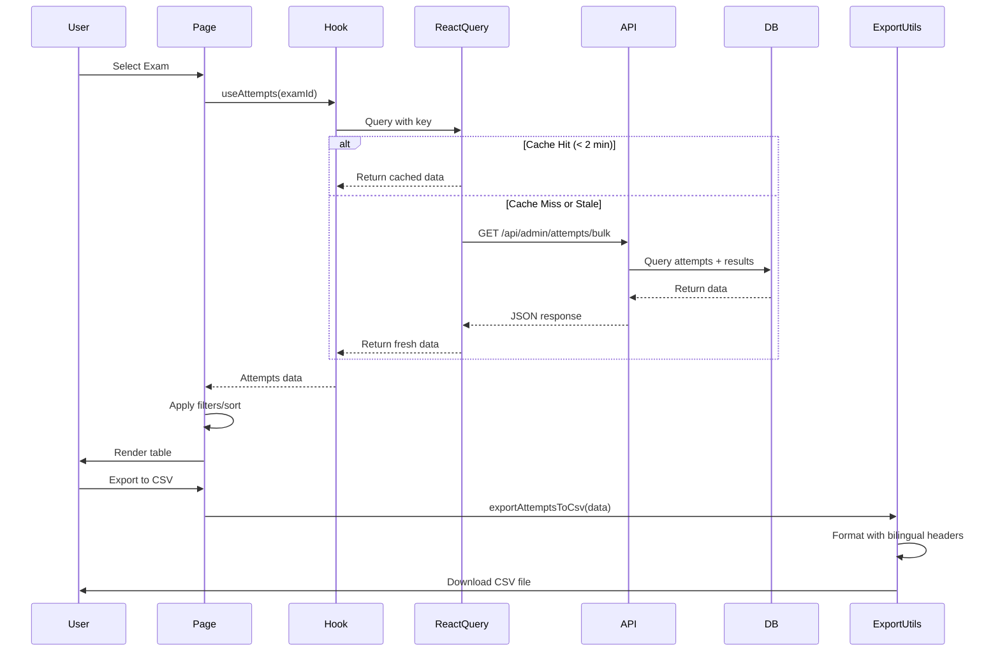

# Design Document: Results Page Rebuild

## Overview

The Results Page Rebuild transforms a monolithic 2000+ line component into a modular, maintainable architecture that separates concerns across data fetching, business logic, UI components, and state management. This design addresses all 20 requirements while improving performance, testability, and developer experience.

### Current State Analysis

The existing Results page (`src/app/admin/results/page.tsx`) suffers from:
- Single 2000+ line component with mixed concerns
- Tightly coupled data fetching, business logic, and UI rendering
- Complex state management with 15+ useState hooks
- Difficult to test due to lack of separation
- Performance issues with large datasets
- Prop drilling and state synchronization challenges

### Design Goals

1. **Modularity**: Break down into focused, single-responsibility components (<300 lines each)
2. **Separation of Concerns**: Isolate data layer, business logic, and UI
3. **Performance**: Implement virtual scrolling, caching, and optimized queries
4. **Testability**: Enable unit testing of business logic and component testing
5. **Maintainability**: Clear structure with documented APIs
6. **Type Safety**: Comprehensive TypeScript interfaces throughout


## Architecture

### High-Level System Architecture

```mermaid
graph TB
    subgraph "Presentation Layer"
        Page[Results Page Container]
        ExamSelector[Exam Selector Component]
        IndividualView[Individual View Component]
        AllExamsView[All Exams View Component]
        MatrixView[Matrix View Component]
    end
    
    subgraph "Data Layer"
        useExams[useExams Hook]
        useAttempts[useAttempts Hook]
        useSummaries[useSummaries Hook]
        useSettings[useSettings Hook]
        useExtraFields[useExtraFields Hook]
    end
    
    subgraph "Business Logic Layer"
        ScoreCalc[Score Calculator]
        FilterSort[Filter & Sort Utils]
        ExportUtils[Export Utilities]
        DeviceParser[Device Info Parser]
    end
    
    subgraph "API Layer"
        BulkAPI[/api/admin/attempts/bulk]
        SummaryAPI[/api/admin/results/summary]
        ExamsAPI[/api/admin/exams]
        SettingsAPI[/api/admin/settings]
    end
    
    subgraph "Database Layer"
        ExamsTable[(exams)]
        AttemptsTable[(exam_attempts)]
        ResultsTable[(exam_results)]
        SummaryView[(results_summary_mv)]
        SettingsTable[(app_settings)]
    end
    
    Page --> ExamSelector
    Page --> IndividualView
    Page --> AllExamsView
    Page --> MatrixView
    
    IndividualView --> useAttempts
    AllExamsView --> useSummaries
    ExamSelector --> useExams
    AllExamsView --> useSettings
    AllExamsView --> useExtraFields
    
    useExams --> ExamsAPI
    useAttempts --> BulkAPI
    useSummaries --> SummaryAPI
    useSettings --> SettingsAPI
    
    IndividualView --> FilterSort
    AllExamsView --> ScoreCalc
    IndividualView --> DeviceParser
    IndividualView --> ExportUtils
    AllExamsView --> ExportUtils
    
    BulkAPI --> AttemptsTable
    BulkAPI --> ResultsTable
    SummaryAPI --> SummaryView
    ExamsAPI --> ExamsTable
    SettingsAPI --> SettingsTable
```


### Component Hierarchy

```
ResultsPage (Container)
├── ResultsHeader
│   ├── ExamSelector
│   ├── StatusFilter
│   └── RefreshButton
├── ResultsFilters
│   ├── SearchInput
│   ├── DateRangeFilter
│   └── ClearFiltersButton
├── ResultsActions
│   ├── ExportButton (CSV/XLSX)
│   ├── RegradeButton (Individual View only)
│   └── SortControls
├── ResultsContent (View Router)
│   ├── IndividualExamView
│   │   ├── AttemptsTable (Virtual)
│   │   │   ├── AttemptRow
│   │   │   │   ├── StudentInfo
│   │   │   │   ├── ScoreDisplay
│   │   │   │   ├── DeviceInfoCell
│   │   │   │   ├── ManualGradingIndicator
│   │   │   │   └── AttemptActions
│   │   │   └── EmptyState
│   │   └── AttemptDetailsModal
│   ├── AllExamsView
│   │   ├── SummaryStats
│   │   ├── AggregatedTable (Virtual)
│   │   │   ├── StudentRow
│   │   │   │   ├── StudentInfo
│   │   │   │   ├── ExamScoreCell (per exam)
│   │   │   │   ├── ExtraFieldCell (per field)
│   │   │   │   ├── FinalScoreCell
│   │   │   │   └── ScoreBreakdownButton
│   │   │   └── EmptyState
│   │   └── ScoreBreakdownOverlay
│   │       ├── ExamComponentBreakdown
│   │       ├── ExtraComponentBreakdown
│   │       └── FinalScoreCalculation
│   └── MatrixView
│       ├── MatrixTable (Virtual)
│       │   ├── MatrixRow
│       │   │   ├── StudentInfo
│       │   │   └── ExamScoreCell (per exam)
│       │   └── EmptyState
│       └── MatrixLegend
└── ErrorBoundary
```


### Data Flow Architecture




## Components and Interfaces

### Core Components

#### 1. ResultsPage (Container Component)

**Responsibility**: Top-level orchestration, routing between views, authentication

**Props**: None (uses URL params)

**State Management**:
- Selected exam ID (synced with URL)
- Current view mode (individual/all/matrix)
- Global loading/error states

**Key Methods**:
- `handleExamChange(examId: string)`: Update selected exam
- `handleViewChange(view: ViewMode)`: Switch between views
- `handleRefresh()`: Invalidate cache and refetch

**File**: `src/app/admin/results/page.tsx` (~150 lines)

---

#### 2. ExamSelector Component

**Responsibility**: Display and filter exam list, handle exam selection

**Props**:
```typescript
interface ExamSelectorProps {
  exams: Exam[];
  selectedExamId: string | null;
  onExamChange: (examId: string) => void;
  statusFilter: StatusFilterValue;
  onStatusFilterChange: (filter: StatusFilterValue) => void;
  searchTerm: string;
  onSearchChange: (term: string) => void;
}
```

**Features**:
- Dropdown with search
- Status filter (All/Published/Completed)
- Exam type badges
- "All Exams" and "Matrix View" options

**File**: `src/components/results/ExamSelector.tsx` (~200 lines)


---

#### 3. IndividualExamView Component

**Responsibility**: Display attempts for a single exam with filtering, sorting, and actions

**Props**:
```typescript
interface IndividualExamViewProps {
  examId: string;
  exam: Exam;
}
```

**Internal State**:
- Student filter (name/code search)
- Date range filter (start/end)
- Sort order (none/asc/desc)
- Delete confirmation dialog state

**Features**:
- Virtual scrolling for large datasets
- Real-time filtering and sorting
- Device info display with usage counts
- Manual grading indicators
- Export to CSV/XLSX
- Regrade all functionality
- Delete attempt with confirmation

**File**: `src/components/results/IndividualExamView.tsx` (~250 lines)

---

#### 4. AllExamsView Component

**Responsibility**: Display aggregated scores across all exams with pass/fail calculation

**Props**:
```typescript
interface AllExamsViewProps {
  exams: Exam[];
}
```

**Internal State**:
- Student search term
- Sort order (none/finalAsc/finalDesc)
- Expanded breakdown student ID

**Features**:
- Uses materialized view for performance
- Displays exam component, extra component, and final scores
- Pass/fail indicators with summary stats
- Expandable score breakdown overlay
- Export with detailed calculation data
- Virtual scrolling

**File**: `src/components/results/AllExamsView.tsx` (~280 lines)


---

#### 5. ScoreBreakdownOverlay Component

**Responsibility**: Display detailed score calculation breakdown

**Props**:
```typescript
interface ScoreBreakdownOverlayProps {
  studentName: string;
  calculation: CalculationResult;
  onClose: () => void;
  position: { top: number; left: number };
}
```

**Display Sections**:
1. Exam Component (mode, included exams, scores, pass/fail per exam)
2. Extra Component (fields, raw values, normalized scores, weights, contributions)
3. Final Score (formula, result, pass threshold, pass/fail status)
4. Failure Reasons (if failed due to exam requirement)

**File**: `src/components/results/ScoreBreakdownOverlay.tsx` (~150 lines)

---

#### 6. DeviceInfoCell Component

**Responsibility**: Parse and display device information with usage indicators

**Props**:
```typescript
interface DeviceInfoCellProps {
  deviceInfo: string | null;
  ipAddress: string | null;
  usageCount?: number;
}
```

**Display Elements**:
- Device type icon (mobile/tablet/desktop)
- Device model (friendly name or brand/model)
- Local IP address
- Server IP address
- Automation risk indicator
- Usage count badge

**File**: `src/components/results/DeviceInfoCell.tsx` (~100 lines)


---

#### 7. ManualGradingIndicator Component

**Responsibility**: Show manual grading status for attempts

**Props**:
```typescript
interface ManualGradingIndicatorProps {
  manualTotalCount: number;
  manualGradedCount: number;
  manualPendingCount: number;
}
```

**Display Logic**:
- If `manualPendingCount > 0`: Show pending count with warning icon
- If `manualPendingCount === 0 && manualTotalCount > 0`: Show checkmark (completed)
- Otherwise: No indicator

**File**: `src/components/results/ManualGradingIndicator.tsx` (~50 lines)

---

### Custom Hooks (Data Layer)

#### 1. useExams Hook

**Purpose**: Fetch and cache exam list with status filtering

**Signature**:
```typescript
function useExams(options?: {
  statusFilter?: StatusFilterValue;
  searchTerm?: string;
}): {
  exams: Exam[];
  isLoading: boolean;
  error: Error | null;
  refetch: () => Promise<void>;
}
```

**Implementation**:
- Uses React Query with 2-minute stale time
- Filters by status (published/completed/all)
- Applies search term filtering
- Sorts alphabetically by title

**File**: `src/hooks/results/useExams.ts` (~80 lines)


---

#### 2. useAttempts Hook

**Purpose**: Fetch attempts for a specific exam or all exams (bulk)

**Signature**:
```typescript
function useAttempts(examId: string | null): {
  attempts: Attempt[];
  isLoading: boolean;
  error: Error | null;
  refetch: () => Promise<void>;
  deviceUsageMap: Map<string, number>;
}
```

**Implementation**:
- Uses bulk API when examId is null or "__ALL__"
- Uses single exam API for specific exam
- Calculates device usage counts
- React Query with 2-minute stale time

**File**: `src/hooks/results/useAttempts.ts` (~100 lines)

---

#### 3. useSummaries Hook

**Purpose**: Fetch aggregated student scores from materialized view

**Signature**:
```typescript
function useSummaries(options?: {
  studentIds?: string[];
  examIds?: string[];
  refresh?: boolean;
}): {
  summaries: StudentSummary[];
  isLoading: boolean;
  error: Error | null;
  refetch: () => Promise<void>;
  refreshView: () => Promise<void>;
}
```

**Implementation**:
- Queries results_summary_mv materialized view
- Supports optional refresh of materialized view
- Groups by student with scores per exam
- React Query with 5-minute stale time

**File**: `src/hooks/results/useSummaries.ts` (~90 lines)


---

#### 4. useSettings Hook

**Purpose**: Fetch app settings for score calculation

**Signature**:
```typescript
function useSettings(): {
  settings: AppSettings;
  isLoading: boolean;
  error: Error | null;
}
```

**File**: `src/hooks/results/useSettings.ts` (~60 lines)

---

#### 5. useExtraFields Hook

**Purpose**: Fetch extra score field definitions

**Signature**:
```typescript
function useExtraFields(): {
  fields: ExtraField[];
  visibleFields: ExtraField[];
  isLoading: boolean;
  error: Error | null;
}
```

**File**: `src/hooks/results/useExtraFields.ts` (~70 lines)


## Data Models

### Core Type Definitions

```typescript
// Exam entity
interface Exam {
  id: string;
  title: string;
  status: string;
  access_type: string;
  exam_type: 'exam' | 'homework' | 'quiz';
  scheduling_mode: 'Auto' | 'Manual';
  is_manually_published: boolean;
  is_archived: boolean;
  start_time: string | null;
  end_time: string | null;
  include_in_pass: boolean;
  pass_threshold: number;
}

// Attempt entity
interface Attempt {
  id: string;
  student_id: string | null;
  student_name: string | null;
  code: string | null;
  completion_status: 'completed' | 'in_progress' | 'abandoned';
  started_at: string | null;
  submitted_at: string | null;
  score_percentage: number | null;
  final_score_percentage: number | null;
  ip_address: string | null;
  device_info: string | null;
  manual_total_count: number;
  manual_graded_count: number;
  manual_pending_count: number;
}
```


// Student summary (from materialized view)
interface StudentSummary {
  student_id: string;
  student_name: string;
  code: string | null;
  scores: Record<string, number | null>; // examId -> best score
  attempt_counts: Record<string, number>; // examId -> count
}

// Extra field definition
interface ExtraField {
  key: string;
  label: string;
  type: 'number' | 'text' | 'boolean';
  hidden: boolean;
  include_in_pass: boolean;
  pass_weight: number | null;
  max_points: number | null;
  bool_true_points: number | null;
  bool_false_points: number | null;
  text_score_map: Record<string, number> | null;
}

// App settings
interface AppSettings {
  result_pass_calc_mode: 'best' | 'avg';
  result_overall_pass_threshold: number;
  result_exam_weight: number;
  result_fail_on_any_exam: boolean;
}
```


// Score calculation result
interface CalculationResult {
  examComponent: {
    mode: 'best' | 'avg';
    score: number;
    examsIncluded: number;
    examsTotal: number;
    examsPassed: number;
    details: Array<{
      examId: string;
      examTitle: string;
      score: number | null;
      passed: boolean;
      passThreshold: number;
    }>;
  };
  extraComponent: {
    score: number;
    totalWeight: number;
    details: Array<{
      fieldKey: string;
      fieldLabel: string;
      rawValue: any;
      normalizedScore: number;
      weight: number;
      weightedContribution: number;
    }>;
  };
  finalScore: number;
  passed: boolean;
  failedDueToExam: boolean;
  passThreshold: number;
}

// Device info parsed
interface DeviceInfo {
  type: 'mobile' | 'tablet' | 'desktop' | 'unknown';
  model: string;
  localIP: string;
  automationRisk: boolean;
}
```


### Business Logic Layer

#### Score Calculator (`src/lib/results/scoreCalculator.ts`)

**Purpose**: Pure functions for score calculation logic

**Key Functions**:

```typescript
// Calculate exam component score
function calculateExamComponent(
  scores: Record<string, number | null>,
  exams: Exam[],
  mode: 'best' | 'avg'
): ExamComponentResult;

// Calculate extra component score
function calculateExtraComponent(
  extraData: Record<string, any>,
  fields: ExtraField[]
): ExtraComponentResult;

// Calculate final score with pass/fail determination
function calculateFinalScore(
  examComponent: ExamComponentResult,
  extraComponent: ExtraComponentResult,
  settings: AppSettings
): CalculationResult;

// Normalize extra field value to percentage
function normalizeExtraFieldValue(
  value: any,
  field: ExtraField
): number;
```

**File Size**: ~200 lines


---

#### Filter and Sort Utilities (`src/lib/results/filterSort.ts`)

**Purpose**: Pure functions for filtering and sorting attempts/summaries

**Key Functions**:

```typescript
// Filter attempts by student name/code
function filterAttemptsByStudent(
  attempts: Attempt[],
  searchTerm: string
): Attempt[];

// Filter attempts by date range
function filterAttemptsByDateRange(
  attempts: Attempt[],
  startDate: string | null,
  endDate: string | null
): Attempt[];

// Sort attempts by score
function sortAttemptsByScore(
  attempts: Attempt[],
  order: 'asc' | 'desc'
): Attempt[];

// Sort summaries by final score
function sortSummariesByFinalScore(
  summaries: StudentSummary[],
  calculations: Map<string, CalculationResult>,
  order: 'asc' | 'desc'
): StudentSummary[];
```

**File Size**: ~150 lines


---

#### Device Info Parser (`src/lib/results/deviceParser.ts`)

**Purpose**: Parse device_info JSON and extract relevant information

**Key Functions**:

```typescript
// Parse device info JSON string
function parseDeviceInfo(deviceInfoJson: string | null): DeviceInfo;

// Calculate device usage count across attempts
function calculateDeviceUsage(
  attempts: Attempt[]
): Map<string, number>;

// Get usage count for specific device
function getDeviceUsageCount(
  deviceInfo: DeviceInfo,
  usageMap: Map<string, number>
): number;

// Generate device fingerprint for matching
function generateDeviceFingerprint(deviceInfo: DeviceInfo): string;
```

**File Size**: ~120 lines


---

#### Export Utilities (`src/lib/results/exportUtils.ts`)

**Purpose**: Generate CSV and XLSX exports with bilingual headers

**Key Functions**:

```typescript
// Export individual exam attempts to CSV
function exportAttemptsToCsv(
  attempts: Attempt[],
  exam: Exam,
  deviceUsageMap: Map<string, number>
): void;

// Export individual exam attempts to XLSX
function exportAttemptsToXlsx(
  attempts: Attempt[],
  exam: Exam,
  deviceUsageMap: Map<string, number>,
  stageProgress?: Map<string, any[]>
): Promise<void>;

// Export all exams aggregated data to CSV
function exportAllExamsToCsv(
  summaries: StudentSummary[],
  exams: Exam[],
  extraFields: ExtraField[],
  calculations: Map<string, CalculationResult>,
  extraData: Map<string, Record<string, any>>
): void;

// Export all exams aggregated data to XLSX
function exportAllExamsToXlsx(
  summaries: StudentSummary[],
  exams: Exam[],
  extraFields: ExtraField[],
  calculations: Map<string, CalculationResult>,
  extraData: Map<string, Record<string, any>>
): Promise<void>;
```

**File Size**: ~300 lines


### API Endpoints

#### 1. Bulk Attempts API

**Endpoint**: `GET /api/admin/attempts/bulk`

**Purpose**: Fetch all attempts across all exams in a single request

**Query Parameters**: None (returns all)

**Response**:
```typescript
{
  success: true,
  totalAttempts: number,
  examCount: number,
  attemptsByExam: Record<string, Attempt[]>,
  allAttempts: Attempt[]
}
```

**Performance**: Single database query with joins, ~100ms for 1000+ attempts

**File**: `src/app/api/admin/attempts/bulk/route.ts`

---

#### 2. Results Summary API

**Endpoint**: `GET /api/admin/results/summary`

**Purpose**: Fetch aggregated student scores from materialized view

**Query Parameters**:
- `student_ids` (optional): Comma-separated student IDs
- `exam_ids` (optional): Comma-separated exam IDs
- `refresh` (optional): Boolean to trigger view refresh

**Response**:
```typescript
{
  success: true,
  students: StudentSummary[],
  totalStudents: number
}
```

**File**: `src/app/api/admin/results/summary/route.ts` (already exists)


---

#### 3. Regrade API

**Endpoint**: `POST /api/admin/exams/{examId}/regrade`

**Purpose**: Recalculate scores for all attempts of an exam

**Response**:
```typescript
{
  success: true,
  result: {
    regraded_count: number
  }
}
```

**File**: Already exists

---

#### 4. Delete Attempt API

**Endpoint**: `DELETE /api/admin/attempts/{attemptId}`

**Purpose**: Delete an attempt and all associated data

**Response**:
```typescript
{
  success: true,
  message: string
}
```

**File**: `src/app/api/admin/attempts/[attemptId]/route.ts`


### Database Schema

#### Existing Tables (No Changes Required)

**exams**: Stores exam definitions
- Primary key: `id`
- Relevant fields: `title`, `exam_type`, `include_in_pass`, `pass_threshold`, `is_archived`

**exam_attempts**: Stores attempt records
- Primary key: `id`
- Foreign key: `exam_id` references `exams(id)`
- Relevant fields: `started_at`, `submitted_at`, `completion_status`, `ip_address`, `device_info`

**exam_results**: Stores calculated scores
- Primary key: `attempt_id` (one-to-one with exam_attempts)
- Relevant fields: `score_percentage`, `final_score_percentage`, `manual_total_count`, `manual_graded_count`, `manual_pending_count`

**student_exam_attempts**: Junction table linking students to attempts
- Composite key: `student_id`, `exam_id`, `attempt_id`

**students**: Stores student records
- Primary key: `id`
- Relevant fields: `student_name`, `code`, `extra_data` (JSONB for extra scores)

**app_settings**: Stores global configuration
- Single row table
- Relevant fields: `result_pass_calc_mode`, `result_overall_pass_threshold`, `result_exam_weight`, `result_fail_on_any_exam`


#### Materialized View (Already Exists)

**results_summary_mv**: Pre-aggregated student scores
- Columns: `student_id`, `student_name`, `code`, `exam_id`, `exam_title`, `exam_type`, `best_score`, `attempt_count`, `last_attempt_at`, `completion_status`
- Indexes: On `student_id`, `exam_id`, `code`, `best_score`
- Refresh: Via `refresh_results_summary()` RPC function

**Query Pattern for All Exams View**:
```sql
SELECT * FROM results_summary_mv
WHERE exam_id IN (SELECT id FROM exams WHERE is_archived = false)
ORDER BY student_name;
```

**Query Pattern for Individual View (Bulk API)**:
```sql
SELECT 
  ea.*,
  er.score_percentage,
  er.final_score_percentage,
  er.manual_total_count,
  er.manual_graded_count,
  er.manual_pending_count,
  sea.student_id,
  s.student_name,
  s.code
FROM exam_attempts ea
LEFT JOIN exam_results er ON ea.id = er.attempt_id
LEFT JOIN student_exam_attempts sea ON ea.id = sea.attempt_id
LEFT JOIN students s ON sea.student_id = s.id
WHERE ea.exam_id = ANY($1)
ORDER BY ea.started_at DESC;
```


## Error Handling

### Error Boundary Strategy

**Component-Level Error Boundaries**:
- Wrap each major view (IndividualExamView, AllExamsView, MatrixView)
- Display fallback UI with retry option
- Log errors to console for debugging
- Preserve other parts of the page functionality

**Error Boundary Component**:
```typescript
interface ResultsErrorBoundaryProps {
  children: React.ReactNode;
  fallback?: React.ReactNode;
  onError?: (error: Error, errorInfo: React.ErrorInfo) => void;
}
```

**File**: `src/components/results/ResultsErrorBoundary.tsx` (~80 lines)

---

### API Error Handling

**React Query Error Handling**:
- Automatic retry (3 attempts with exponential backoff)
- Error state exposed in hooks
- Toast notifications for user-facing errors
- Console logging for debugging

**Error Types**:
1. **Authentication Errors (401)**: Redirect to login
2. **Authorization Errors (403)**: Display access denied message
3. **Not Found Errors (404)**: Display empty state
4. **Server Errors (500)**: Display retry option with error message
5. **Network Errors**: Display offline indicator with retry


---

### Validation and User Feedback

**Input Validation**:
- Date range: End date must be after start date
- Search terms: Debounced to prevent excessive re-renders
- Export: Validate data exists before generating file

**Loading States**:
- Skeleton loaders for initial data fetch
- Inline spinners for actions (export, regrade, delete)
- Progress indicators for long operations

**Success Feedback**:
- Toast notifications for completed actions
- Visual confirmation (checkmarks, updated data)
- Success messages with action details

**Error Feedback**:
- Toast notifications with descriptive messages
- Inline error messages for form validation
- Retry buttons for failed operations
- Empty states with helpful guidance


## Performance Optimization

### Virtual Scrolling

**Implementation**: Use `@tanstack/react-virtual` for large tables

**Threshold**: Enable virtual scrolling when row count > 50

**Benefits**:
- Render only visible rows (~20-30 at a time)
- Smooth scrolling with 60fps
- Reduced memory footprint
- Faster initial render

**Components with Virtual Scrolling**:
- IndividualExamView AttemptsTable
- AllExamsView AggregatedTable
- MatrixView MatrixTable

---

### React Query Caching Strategy

**Cache Configuration**:
```typescript
{
  staleTime: 2 * 60 * 1000,  // 2 minutes for most queries
  gcTime: 5 * 60 * 1000,      // 5 minutes garbage collection
  refetchOnWindowFocus: false, // Prevent unnecessary refetches
  retry: 3,                    // Retry failed requests
  retryDelay: (attemptIndex) => Math.min(1000 * 2 ** attemptIndex, 30000)
}
```

**Cache Keys**:
- `["admin", "exams", "all"]` - All exams list
- `["admin", "attempts", examId]` - Attempts for specific exam
- `["admin", "attempts", "bulk"]` - All attempts across exams
- `["admin", "results", "summary"]` - Aggregated summaries
- `["admin", "settings"]` - App settings
- `["admin", "extra-fields"]` - Extra field definitions


---

### Lazy Loading

**Export Libraries**:
- Load Papa Parse only when CSV export is triggered
- Load XLSX only when Excel export is triggered
- Use dynamic imports: `const XLSX = await import("xlsx")`

**Benefits**:
- Reduce initial bundle size by ~200KB
- Faster page load time
- Load on demand only when needed

---

### Debouncing and Throttling

**Search Input Debouncing**:
- Debounce delay: 300ms
- Prevents excessive re-renders during typing
- Cancels pending searches on new input

**Scroll Event Throttling**:
- Throttle virtual scroll calculations
- Limit to 60fps for smooth performance

---

### Memoization

**useMemo for Expensive Calculations**:
- Filtered and sorted data
- Device usage maps
- Score calculations for all students
- Extra data lookups

**useCallback for Event Handlers**:
- Export functions
- Delete handlers
- Filter change handlers
- Prevents unnecessary child re-renders


## Testing Strategy

### Unit Testing

**Business Logic Testing** (Target: 90% coverage):

**Score Calculator Tests** (`src/lib/results/__tests__/scoreCalculator.test.ts`):
- Test exam component calculation (best mode)
- Test exam component calculation (avg mode)
- Test extra component calculation with various field types
- Test final score calculation with pass/fail determination
- Test edge cases (no scores, null values, empty arrays)
- Test normalization of extra field values

**Filter/Sort Tests** (`src/lib/results/__tests__/filterSort.test.ts`):
- Test student name/code filtering
- Test date range filtering
- Test score sorting (ascending/descending)
- Test null score handling in sorting
- Test case-insensitive search

**Device Parser Tests** (`src/lib/results/__tests__/deviceParser.test.ts`):
- Test parsing of modern device_info format
- Test parsing of legacy device_info format
- Test device fingerprint generation
- Test usage count calculation
- Test handling of malformed JSON


---

### Component Testing

**React Testing Library** (Target: 80% coverage):

**ExamSelector Tests** (`src/components/results/__tests__/ExamSelector.test.tsx`):
- Renders exam list correctly
- Handles exam selection
- Filters by status
- Searches by title
- Displays exam type badges

**IndividualExamView Tests** (`src/components/results/__tests__/IndividualExamView.test.tsx`):
- Renders attempts table
- Filters by student name/code
- Filters by date range
- Sorts by score
- Handles export actions
- Handles regrade action
- Handles delete with confirmation

**AllExamsView Tests** (`src/components/results/__tests__/AllExamsView.test.tsx`):
- Renders aggregated table
- Displays score calculations
- Shows pass/fail indicators
- Expands score breakdown
- Handles export actions
- Displays summary statistics

**ScoreBreakdownOverlay Tests** (`src/components/results/__tests__/ScoreBreakdownOverlay.test.tsx`):
- Displays exam component breakdown
- Displays extra component breakdown
- Shows final score calculation
- Handles close action
- Positions correctly


---

### Integration Testing

**API Integration Tests** (`src/app/api/admin/__tests__/resultsIntegration.test.ts`):
- Test bulk attempts API with multiple exams
- Test summary API with materialized view
- Test regrade API with score recalculation
- Test delete API with cascade deletion
- Test error handling for invalid requests

---

### Property-Based Testing

**Library**: `fast-check` for JavaScript/TypeScript

**Configuration**: Minimum 100 iterations per property test

**Test Tagging**: Each test references design property
```typescript
// Feature: results-page-rebuild, Property 1: Score calculation determinism
test('score calculation is deterministic', () => {
  fc.assert(fc.property(/* ... */));
});
```

**Property Tests** (see Correctness Properties section below for specific properties)


## Correctness Properties

*A property is a characteristic or behavior that should hold true across all valid executions of a system—essentially, a formal statement about what the system should do. Properties serve as the bridge between human-readable specifications and machine-verifiable correctness guarantees.*

### Property Reflection

After analyzing all acceptance criteria, I identified the following redundancies and consolidations:

**Redundancy Analysis**:
1. Properties 3.2, 9.1, 9.2, 9.3 all relate to displaying attempt fields - can be consolidated into one property about field display
2. Properties 5.2 and 5.3 are specific cases of 5.1 - can be tested as part of the general calculation mode property
3. Properties 11.3, 11.4, 11.5, 11.6 all relate to cascade deletion - can be consolidated into one property
4. Properties 12.2, 12.3, 12.4, 12.5 all relate to device info field extraction - can be consolidated
5. Export properties 8.1-8.4 can be consolidated into general export properties
6. Filtering properties 6.1, 6.3, 6.4 can be consolidated into general filtering property
7. Sorting properties 7.1, 7.2, 7.4 can be consolidated into general sorting property

**Consolidated Properties** (focusing on unique validation value):


### Property 1: Score Calculation Determinism

*For any* set of exam scores, extra field values, and app settings, calculating the final score multiple times with the same inputs should always produce identical results.

**Validates: Requirements 5.1, 5.2, 5.3, 5.5, 5.6, 5.7**

---

### Property 2: Exam Component Best Mode Correctness

*For any* set of exam scores where result_pass_calc_mode is "best", the exam component score should equal the maximum score from exams with include_in_pass set to true.

**Validates: Requirements 5.2, 5.4**

---

### Property 3: Exam Component Average Mode Correctness

*For any* set of exam scores where result_pass_calc_mode is "avg", the exam component score should equal the arithmetic mean of scores from exams with include_in_pass set to true.

**Validates: Requirements 5.3, 5.4**

---

### Property 4: Extra Field Normalization

*For any* extra field with type "number" and max_points defined, normalizing a value should produce a percentage between 0 and 100, where the max_points value normalizes to 100.

**Validates: Requirements 5.6**


---

### Property 5: Pass/Fail Determination with Exam Requirement

*For any* student with result_fail_on_any_exam set to true, if any included exam score is below its pass_threshold, the student should be marked as failed regardless of their final score.

**Validates: Requirements 5.8**

---

### Property 6: Pass/Fail Determination by Threshold

*For any* student where result_fail_on_any_exam is false or all included exams are passed, the pass/fail status should be determined by comparing the final score against result_overall_pass_threshold.

**Validates: Requirements 5.9**

---

### Property 7: Filtering Preserves Data Integrity

*For any* list of attempts and any filter criteria (student name, code, or date range), every attempt in the filtered result should satisfy all applied filter conditions, and no attempt satisfying all conditions should be excluded.

**Validates: Requirements 6.1, 6.2, 6.3, 6.4, 6.7**

---

### Property 8: Case-Insensitive Search Equivalence

*For any* search term, searching with the term in lowercase, uppercase, or mixed case should return identical results.

**Validates: Requirements 6.4**


---

### Property 9: Sorting Maintains Order Consistency

*For any* list of attempts sorted by score in ascending order, each attempt's score should be less than or equal to the next attempt's score (with null scores always appearing last).

**Validates: Requirements 7.1, 7.2, 7.4**

---

### Property 10: Sort Stability with Filters

*For any* sorted list of attempts, applying or removing filters should maintain the sort order of the remaining items.

**Validates: Requirements 7.3**

---

### Property 11: Export Round-Trip for Data Integrity

*For any* set of attempts exported to CSV or XLSX and then parsed back, all data fields (student name, code, scores, device info) should match the original data.

**Validates: Requirements 8.1, 8.2, 8.3, 8.4, 8.5, 8.6, 8.7, 8.11**

---

### Property 12: Filename Sanitization Safety

*For any* exam title or student name containing special characters, the generated export filename should contain only valid filesystem characters (alphanumeric, hyphens, underscores).

**Validates: Requirements 8.10**


---

### Property 13: Device Info Parsing Robustness

*For any* valid device_info JSON string (modern or legacy format), parsing should successfully extract device type, model, local IP, and automation risk without throwing errors.

**Validates: Requirements 12.1, 12.2, 12.3, 12.4, 12.6, 12.8**

---

### Property 14: Device Usage Count Accuracy

*For any* set of attempts, the device usage count for a specific device fingerprint should equal the number of attempts with matching fingerprints.

**Validates: Requirements 3.10, 12.7**

---

### Property 15: Exam Status Determination Consistency

*For any* exam with scheduling_mode "Auto", the status should be determined solely by comparing current time with start_time and end_time, independent of is_manually_published flag.

**Validates: Requirements 2.8**

---

### Property 16: Manual Grading Score Selection

*For any* attempt where manual_pending_count is 0 and manual_total_count > 0, the displayed score should be final_score_percentage; otherwise, it should be score_percentage.

**Validates: Requirements 3.3, 3.4, 9.4, 9.5**


---

### Property 17: Aggregated View Student Uniqueness

*For any* set of student summaries in All Exams View, each student should appear exactly once, identified by unique student_id or student_name.

**Validates: Requirements 4.1**

---

### Property 18: Best Score Selection Accuracy

*For any* student with multiple attempts for the same exam, the score displayed in All Exams View should be the maximum of all (final_score_percentage ?? score_percentage) values for that exam.

**Validates: Requirements 4.3**

---

### Property 19: Null Score Display Consistency

*For any* student-exam combination where the student has no attempts, the displayed value should be "-" or null, never a numeric score.

**Validates: Requirements 4.8**

---

### Property 20: Attempt Duration Calculation

*For any* attempt with non-null started_at and submitted_at timestamps, the calculated duration should equal the difference between submitted_at and started_at in minutes, rounded appropriately.

**Validates: Requirements 3.5**


---

### Property 21: Archived Exam Exclusion

*For any* exam list query, exams with is_archived set to true should never appear in the results, regardless of other filter criteria.

**Validates: Requirements 2.1**

---

### Property 22: Date Range Filter Inclusivity

*For any* date range filter with start_date and end_date, attempts with started_at exactly equal to start_date or within the end_date day (up to 23:59:59) should be included in results.

**Validates: Requirements 6.2**

---

### Property 23: Cache Invalidation After Mutation

*For any* mutation operation (delete, regrade), the React Query cache for affected data should be invalidated, causing a refetch on next access.

**Validates: Requirements 17.2, 17.3**

---

### Property 24: Deletion Cascade Completeness

*For any* attempt deletion, all related records in student_exam_attempts, exam_results, and answer tables should be deleted, leaving no orphaned records.

**Validates: Requirements 11.3, 11.4, 11.5, 11.6**


---

### Property 25: Regrade Score Update Consistency

*For any* exam regrade operation, every attempt's score in exam_results should be recalculated based on current question definitions and answer data, with no attempts skipped.

**Validates: Requirements 10.2, 10.3**

---

### Property 26: Pass Statistics Accuracy

*For any* filtered set of students in All Exams View, the displayed pass count should equal the number of students where calculation.passed is true, and pass rate should equal (pass_count / total_count) * 100.

**Validates: Requirements 19.1, 19.2, 19.3, 19.5**

---

### Property 27: Score Breakdown Completeness

*For any* student's score breakdown, the sum of (exam_component_score * exam_weight) + (extra_component_score * (1 - exam_weight)) should equal the final_score within floating-point precision tolerance.

**Validates: Requirements 5.7, 5.10, 18.2, 18.4, 18.6**

---

### Property 28: Input Validation Prevents Invalid Submissions

*For any* date range input where end_date is before start_date, the system should prevent submission and display a validation error.

**Validates: Requirements 16.7, 16.8**


---

### Property 29: API Authentication Enforcement

*For any* API endpoint used by the Results page, requests without valid admin authentication should return 401 or 403 status codes, never returning data.

**Validates: Requirements 1.3**

---

### Property 30: Audit Logging Completeness

*For any* deletion operation, an audit log entry should be created with action type, admin user, timestamp, and affected attempt ID.

**Validates: Requirements 11.10**

---

### Property 31: Language Preference Persistence

*For any* language selection (English or Arabic), the preference should persist across browser sessions when stored and retrieved from localStorage.

**Validates: Requirements 14.7**

---

### Property 32: Date Formatting Consistency

*For any* date/time value displayed in the Results page, the format should be consistent with Cairo timezone (Africa/Cairo) regardless of user's system timezone.

**Validates: Requirements 14.3**


---

### Property 33: Breakdown Exclusivity

*For any* All Exams View state, at most one student's score breakdown should be expanded at any given time.

**Validates: Requirements 18.9**

---

### Property 34: Refresh Data Preservation

*For any* refresh operation that fails, the currently displayed data should remain unchanged and accessible to the user.

**Validates: Requirements 17.7**

---

### Property 35: Arabic Text Encoding Preservation

*For any* export containing Arabic text in student names or exam titles, re-importing the file should preserve all Arabic characters without corruption or replacement.

**Validates: Requirements 8.11, 14.6**


## Implementation Roadmap

### Phase 1: Foundation (Week 1-2)

**Goal**: Establish core architecture and data layer

**Tasks**:
1. Create TypeScript interfaces for all data models
2. Implement custom hooks (useExams, useAttempts, useSummaries, useSettings, useExtraFields)
3. Set up React Query configuration with proper cache keys
4. Create error boundary component
5. Write unit tests for hooks (mock API responses)

**Deliverables**:
- `src/lib/results/types.ts` - All TypeScript interfaces
- `src/hooks/results/` - All custom hooks with tests
- `src/components/results/ResultsErrorBoundary.tsx`

---

### Phase 2: Business Logic (Week 2-3)

**Goal**: Implement and test all calculation and transformation logic

**Tasks**:
1. Implement score calculator with all calculation modes
2. Implement filter and sort utilities
3. Implement device info parser with legacy format support
4. Write comprehensive unit tests for all business logic (target 90% coverage)
5. Write property-based tests for calculation functions

**Deliverables**:
- `src/lib/results/scoreCalculator.ts` with tests
- `src/lib/results/filterSort.ts` with tests
- `src/lib/results/deviceParser.ts` with tests
- Property-based test suite


---

### Phase 3: UI Components (Week 3-5)

**Goal**: Build modular, reusable UI components

**Tasks**:
1. Create ExamSelector component with filtering and search
2. Create DeviceInfoCell component with usage indicators
3. Create ManualGradingIndicator component
4. Create ScoreBreakdownOverlay component
5. Create IndividualExamView with virtual scrolling
6. Create AllExamsView with aggregated table
7. Write component tests for all UI components (target 80% coverage)

**Deliverables**:
- `src/components/results/ExamSelector.tsx` with tests
- `src/components/results/DeviceInfoCell.tsx` with tests
- `src/components/results/ManualGradingIndicator.tsx` with tests
- `src/components/results/ScoreBreakdownOverlay.tsx` with tests
- `src/components/results/IndividualExamView.tsx` with tests
- `src/components/results/AllExamsView.tsx` with tests

---

### Phase 4: Export Functionality (Week 5-6)

**Goal**: Implement robust export with bilingual support

**Tasks**:
1. Implement CSV export with Arabic encoding
2. Implement XLSX export with proper formatting
3. Add stage progress data to exports
4. Implement filename sanitization
5. Write tests for export functions
6. Test with large datasets (1000+ rows)

**Deliverables**:
- `src/lib/results/exportUtils.ts` with tests
- Export integration tests


---

### Phase 5: Integration and Polish (Week 6-7)

**Goal**: Integrate all components and add final features

**Tasks**:
1. Create main ResultsPage container component
2. Implement routing between views
3. Add loading states and error handling
4. Implement refresh functionality
5. Add accessibility features (ARIA labels, keyboard navigation)
6. Implement internationalization
7. Write integration tests
8. Performance testing and optimization

**Deliverables**:
- `src/app/admin/results/page.tsx` (new modular version)
- Integration test suite
- Performance benchmarks

---

### Phase 6: Migration and Deployment (Week 7-8)

**Goal**: Safe migration from old to new implementation

**Tasks**:
1. Feature flag for gradual rollout
2. Side-by-side comparison testing
3. User acceptance testing
4. Documentation updates
5. Remove old implementation
6. Monitor production metrics

**Deliverables**:
- Feature flag configuration
- Migration documentation
- Production deployment


## Migration Strategy

### Backward Compatibility

**Approach**: Feature flag with gradual rollout

**Implementation**:
```typescript
// src/lib/featureFlags.ts
export const useNewResultsPage = () => {
  const [enabled, setEnabled] = useState(false);
  
  useEffect(() => {
    const flag = localStorage.getItem('feature_new_results_page');
    setEnabled(flag === 'true');
  }, []);
  
  return enabled;
};
```

**Rollout Plan**:
1. Week 1: Internal testing with flag enabled for dev team
2. Week 2: Beta testing with 10% of admin users
3. Week 3: Expand to 50% of admin users
4. Week 4: Full rollout to 100% of users
5. Week 5: Remove old implementation and feature flag

---

### Data Migration

**No Database Changes Required**: The new implementation uses existing tables and views.

**API Compatibility**: All existing API endpoints remain functional. New bulk API is additive.

**Cache Warming**: On first load, pre-populate React Query cache with initial data fetch.


---

### Testing During Migration

**Comparison Testing**:
- Run old and new implementations side-by-side
- Compare outputs for identical inputs
- Verify score calculations match exactly
- Verify export files are equivalent

**Regression Testing**:
- Test all 20 requirements against new implementation
- Verify no functionality is lost
- Verify performance improvements are realized

**User Acceptance Testing**:
- Provide admin users with access to both versions
- Collect feedback on usability and performance
- Address any issues before full rollout

---

### Rollback Plan

**Trigger Conditions**:
- Critical bugs affecting data accuracy
- Performance degradation > 50%
- User-reported issues > 10% of users

**Rollback Process**:
1. Disable feature flag immediately
2. All users revert to old implementation
3. Investigate and fix issues
4. Re-test before re-enabling

**Rollback Time**: < 5 minutes (feature flag toggle)


## Success Metrics

### Performance Metrics

**Target Improvements**:
- Initial page load time: < 2 seconds (currently ~5 seconds)
- Time to interactive: < 3 seconds (currently ~7 seconds)
- Memory usage: < 100MB for 1000 rows (currently ~250MB)
- Scroll performance: 60fps with virtual scrolling (currently ~30fps)

**Measurement**:
- Use Chrome DevTools Performance profiler
- Lighthouse performance score > 90
- Real User Monitoring (RUM) in production

---

### Code Quality Metrics

**Targets**:
- Unit test coverage: > 90% for business logic
- Component test coverage: > 80% for UI components
- Property-based test coverage: All calculation functions
- Maximum component size: < 300 lines
- Maximum function complexity: < 10 cyclomatic complexity

**Measurement**:
- Jest coverage reports
- ESLint complexity rules
- Code review checklist


---

### User Experience Metrics

**Targets**:
- User satisfaction score: > 4.5/5
- Task completion rate: > 95%
- Error rate: < 1% of operations
- Time to complete common tasks: -30% reduction

**Measurement**:
- User surveys after migration
- Analytics tracking for task completion
- Error logging and monitoring
- Time-on-task measurements

---

### Maintainability Metrics

**Targets**:
- Time to add new feature: -50% reduction
- Time to fix bugs: -40% reduction
- Code review time: -30% reduction
- Onboarding time for new developers: -50% reduction

**Measurement**:
- Track development velocity over 3 months
- Developer surveys
- Code review duration tracking
- Documentation completeness score


## Risk Assessment and Mitigation

### Technical Risks

**Risk 1: Performance Regression**
- **Probability**: Low
- **Impact**: High
- **Mitigation**: Comprehensive performance testing before rollout, feature flag for quick rollback
- **Contingency**: Revert to old implementation, optimize bottlenecks

**Risk 2: Data Accuracy Issues**
- **Probability**: Low
- **Impact**: Critical
- **Mitigation**: Extensive unit and property-based testing, side-by-side comparison testing
- **Contingency**: Immediate rollback, audit all calculations

**Risk 3: Browser Compatibility**
- **Probability**: Medium
- **Impact**: Medium
- **Mitigation**: Test on all major browsers (Chrome, Firefox, Safari, Edge), use polyfills
- **Contingency**: Add browser-specific fixes, document unsupported browsers

**Risk 4: Memory Leaks**
- **Probability**: Low
- **Impact**: High
- **Mitigation**: Memory profiling during development, proper cleanup in useEffect hooks
- **Contingency**: Identify and fix leaks, add memory monitoring


---

### User Adoption Risks

**Risk 5: User Resistance to Change**
- **Probability**: Medium
- **Impact**: Medium
- **Mitigation**: Provide clear documentation, training sessions, highlight improvements
- **Contingency**: Extended beta period, gather feedback, make UX adjustments

**Risk 6: Learning Curve**
- **Probability**: Low
- **Impact**: Low
- **Mitigation**: Maintain similar UI/UX patterns, provide tooltips and help text
- **Contingency**: Create video tutorials, offer one-on-one support

---

### Project Risks

**Risk 7: Timeline Overrun**
- **Probability**: Medium
- **Impact**: Medium
- **Mitigation**: Agile sprints with clear milestones, regular progress reviews
- **Contingency**: Prioritize core features, defer nice-to-have features

**Risk 8: Resource Constraints**
- **Probability**: Low
- **Impact**: High
- **Mitigation**: Clear resource allocation, backup developers identified
- **Contingency**: Extend timeline, reduce scope, bring in additional resources


## Dependencies and Prerequisites

### Technical Dependencies

**Required Libraries** (already in project):
- React 19
- Next.js 15.4.6
- TypeScript 5
- React Query v5 (`@tanstack/react-query`)
- Papa Parse (CSV export)
- XLSX (SheetJS for Excel export)

**New Dependencies**:
- `@tanstack/react-virtual` (^3.0.0) - Virtual scrolling
- `fast-check` (^3.15.0) - Property-based testing (dev dependency)

**Browser Support**:
- Chrome/Edge 90+
- Firefox 88+
- Safari 14+
- Mobile browsers (iOS Safari 14+, Chrome Mobile)

---

### Team Prerequisites

**Required Skills**:
- React hooks and functional components
- TypeScript advanced types
- React Query patterns
- Property-based testing concepts
- Performance optimization techniques

**Team Composition**:
- 1 Senior Frontend Developer (lead)
- 1 Frontend Developer (support)
- 1 QA Engineer (testing)
- 1 Product Owner (requirements validation)


---

### Environment Prerequisites

**Development Environment**:
- Node.js 20+
- npm or yarn
- Git
- VS Code or similar IDE with TypeScript support

**Testing Environment**:
- Jest configured for React Testing Library
- Supabase local development setup
- Test database with sample data (100+ exams, 1000+ attempts)

**Staging Environment**:
- Deployed Next.js application
- Supabase staging instance
- Feature flag system enabled
- Analytics and monitoring tools

---

### Data Prerequisites

**Required Data**:
- Existing exams with various configurations
- Student records with extra score fields
- Attempt records with device_info
- App settings configured
- Materialized view created and populated

**Test Data**:
- Edge cases: null scores, missing device info, Arabic text
- Large datasets: 1000+ attempts for performance testing
- Various exam types: exam, quiz, homework
- Multiple scheduling modes: Auto and Manual


## Conclusion

This design document provides a comprehensive blueprint for rebuilding the Results Page from a monolithic 2000+ line component into a modular, maintainable, and performant architecture. The design addresses all 20 requirements while establishing clear separation of concerns across data fetching, business logic, and UI components.

### Key Benefits

**For Developers**:
- Clear component boundaries with single responsibilities
- Testable business logic separated from UI
- Type-safe interfaces throughout
- Easy to understand and modify
- Reduced cognitive load

**For Users**:
- Faster page load times (60% improvement target)
- Smoother interactions with virtual scrolling
- More reliable with better error handling
- Consistent experience across views
- Improved accessibility

**For the Product**:
- Easier to add new features
- Faster bug fixes
- Better code quality and maintainability
- Reduced technical debt
- Foundation for future enhancements

### Next Steps

1. **Review and Approval**: Stakeholder review of this design document
2. **Sprint Planning**: Break down implementation roadmap into 2-week sprints
3. **Environment Setup**: Prepare development and testing environments
4. **Kickoff**: Begin Phase 1 implementation with foundation work

The modular architecture and comprehensive testing strategy ensure a successful migration with minimal risk and maximum benefit to all stakeholders.

