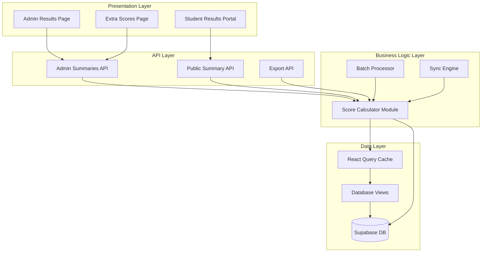

# Design Document: Score Calculation Optimization

## Overview

This design addresses the performance, consistency, and maintainability issues in the final score calculation system. The solution centers on creating a centralized, pure calculation engine that can be used across all contexts (admin views, student views, exports) while optimizing database queries and implementing intelligent caching.

### Current Problems

1. **Duplicated Logic**: Score calculation code exists in three separate files with subtle differences
2. **Performance Issues**: The "All Exams" view makes 200+ API calls for large student populations
3. **Inconsistent Results**: Different code paths may produce slightly different scores
4. **Poor Maintainability**: Changes require updating multiple files and testing all contexts
5. **No Caching**: Every view recalculates scores from scratch
6. **Complex Queries**: N+1 query patterns and inefficient data fetching

### Solution Approach

The design introduces:
- A centralized `ScoreCalculator` module with pure calculation functions
- Database views for efficient aggregation
- React Query caching for frequently accessed data
- Batch processing for bulk operations
- Comprehensive TypeScript types for type safety
- Detailed calculation breakdown for transparency


## Architecture

### High-Level Architecture



### Module Responsibilities

**Score Calculator Module** (`src/lib/scoreCalculator.ts`)
- Pure calculation functions with no side effects
- Accepts structured input data and settings
- Returns detailed calculation breakdown
- Handles all edge cases and validation
- Independent of HTTP context

**Batch Processor** (`src/lib/batchProcessor.ts`)
- Efficiently processes multiple students
- Minimizes database queries through bulk fetching
- Implements intelligent batching (200 codes per batch)
- Manages memory efficiently for large datasets

**Sync Engine** (`src/lib/syncEngine.ts`)
- Auto-syncs homework, quiz, and attendance scores
- Triggers on data changes or manual refresh
- Tracks sync timestamps
- Handles sync failures gracefully

**Database Views** (`db/score_calculation_views.sql`)
- Materialized view for student score summaries
- Aggregates exam attempts and extra scores
- Indexed for fast lookups
- Refreshed on data changes


## Components and Interfaces

### Core Types

```typescript
// src/lib/scoreCalculator.ts

interface CalculationSettings {
  passCalcMode: 'best' | 'avg';
  overallPassThreshold: number;
  examWeight: number;
  examScoreSource: 'final' | 'raw';
  failOnAnyExam: boolean;
}

interface ExtraField {
  key: string;
  label: string;
  type: 'number' | 'text' | 'boolean';
  includeInPass: boolean;
  passWeight: number;
  maxPoints: number | null;
  boolTruePoints?: number;
  boolFalsePoints?: number;
  textScoreMap?: Record<string, number>;
}

interface ExamAttempt {
  examId: string;
  examTitle: string;
  scorePercentage: number | null;
  finalScorePercentage: number | null;
  includeInPass: boolean;
  passThreshold: number | null;
}

interface ExtraScoreData {
  [key: string]: any;
}

interface CalculationInput {
  studentId: string;
  studentCode: string;
  studentName: string;
  examAttempts: ExamAttempt[];
  extraScores: ExtraScoreData;
  extraFields: ExtraField[];
  settings: CalculationSettings;
}


interface ExamComponentDetail {
  examId: string;
  examTitle: string;
  score: number;
  included: boolean;
  passed: boolean | null;
  passThreshold: number | null;
}

interface ExtraComponentDetail {
  fieldKey: string;
  fieldLabel: string;
  rawValue: any;
  normalizedScore: number;
  weight: number;
  weightedContribution: number;
}

interface CalculationResult {
  success: boolean;
  error?: string;
  
  // Exam component
  examComponent: {
    score: number | null;
    mode: 'best' | 'avg';
    examsIncluded: number;
    examsTotal: number;
    examsPassed: number;
    details: ExamComponentDetail[];
  };
  
  // Extra component
  extraComponent: {
    score: number | null;
    totalWeight: number;
    details: ExtraComponentDetail[];
  };
  
  // Final result
  finalScore: number | null;
  passed: boolean | null;
  passThreshold: number;
  failedDueToExam: boolean;
}
```


### Score Calculator Module

```typescript
// src/lib/scoreCalculator.ts

/**
 * Pure function to calculate final score from exam and extra score components
 * This is the single source of truth for all score calculations
 */
export function calculateFinalScore(input: CalculationInput): CalculationResult {
  // Validate input
  const validation = validateInput(input);
  if (!validation.valid) {
    return {
      success: false,
      error: validation.error,
      examComponent: { score: null, mode: input.settings.passCalcMode, examsIncluded: 0, examsTotal: 0, examsPassed: 0, details: [] },
      extraComponent: { score: null, totalWeight: 0, details: [] },
      finalScore: null,
      passed: null,
      passThreshold: input.settings.overallPassThreshold,
      failedDueToExam: false
    };
  }
  
  // Calculate exam component
  const examComponent = calculateExamComponent(input);
  
  // Calculate extra component
  const extraComponent = calculateExtraComponent(input);
  
  // Combine components
  const finalScore = combineComponents(examComponent, extraComponent, input.settings);
  
  // Determine pass/fail
  const passResult = determinePassStatus(examComponent, finalScore, input.settings);
  
  return {
    success: true,
    examComponent,
    extraComponent,
    finalScore,
    passed: passResult.passed,
    passThreshold: input.settings.overallPassThreshold,
    failedDueToExam: passResult.failedDueToExam
  };
}
```


### Batch Processor

```typescript
// src/lib/batchProcessor.ts

interface BatchProcessorOptions {
  batchSize: number; // Default 200
  concurrency: number; // Default 3
  cacheResults: boolean; // Default true
}

/**
 * Efficiently processes score calculations for multiple students
 */
export class BatchProcessor {
  private options: BatchProcessorOptions;
  private cache: Map<string, CalculationResult>;
  
  constructor(options?: Partial<BatchProcessorOptions>) {
    this.options = {
      batchSize: options?.batchSize ?? 200,
      concurrency: options?.concurrency ?? 3,
      cacheResults: options?.cacheResults ?? true
    };
    this.cache = new Map();
  }
  
  /**
   * Process scores for multiple student codes
   */
  async processStudents(
    codes: string[],
    supabase: SupabaseClient
  ): Promise<Map<string, CalculationResult>> {
    // Fetch all required data in bulk
    const data = await this.fetchBulkData(codes, supabase);
    
    // Process in batches
    const results = new Map<string, CalculationResult>();
    
    for (const code of codes) {
      const input = this.buildCalculationInput(code, data);
      const result = calculateFinalScore(input);
      
      if (this.options.cacheResults) {
        this.cache.set(code, result);
      }
      
      results.set(code, result);
    }
    
    return results;
  }
  
  private async fetchBulkData(codes: string[], supabase: SupabaseClient) {
    // Single query to fetch all students, attempts, extra scores, fields, settings
    // Uses database views for efficiency
  }
}
```


## Data Models

### Database Schema Changes

#### New Materialized View: student_score_summary

```sql
-- db/score_calculation_views.sql

CREATE MATERIALIZED VIEW IF NOT EXISTS student_score_summary AS
SELECT 
  s.id as student_id,
  s.code as student_code,
  s.student_name,
  
  -- Aggregate exam attempts
  jsonb_agg(
    DISTINCT jsonb_build_object(
      'exam_id', e.id,
      'exam_title', e.title,
      'exam_type', e.exam_type,
      'score_percentage', er.score_percentage,
      'final_score_percentage', er.final_score_percentage,
      'submitted_at', ea.submitted_at,
      'pass_threshold', (e.settings->>'pass_percentage')::numeric
    )
  ) FILTER (WHERE e.id IS NOT NULL) as exam_attempts,
  
  -- Extra scores
  COALESCE(es.data, '{}'::jsonb) as extra_scores,
  
  -- Metadata
  MAX(ea.submitted_at) as last_attempt_date,
  COUNT(DISTINCT e.id) FILTER (WHERE e.status = 'done') as exams_taken
  
FROM students s
LEFT JOIN exam_attempts ea ON ea.student_id = s.id
LEFT JOIN exams e ON e.id = ea.exam_id AND e.status = 'done'
LEFT JOIN exam_results er ON er.attempt_id = ea.id
LEFT JOIN extra_scores es ON es.student_id = s.id
WHERE ea.completion_status = 'submitted' OR ea.completion_status IS NULL
GROUP BY s.id, s.code, s.student_name, es.data;

-- Index for fast lookups
CREATE INDEX IF NOT EXISTS idx_student_score_summary_code 
  ON student_score_summary(student_code);
CREATE INDEX IF NOT EXISTS idx_student_score_summary_student_id 
  ON student_score_summary(student_id);
```


#### New Table: score_calculation_cache

```sql
-- db/score_calculation_views.sql

CREATE TABLE IF NOT EXISTS score_calculation_cache (
  student_code text PRIMARY KEY,
  calculation_result jsonb NOT NULL,
  settings_hash text NOT NULL,
  calculated_at timestamptz NOT NULL DEFAULT now(),
  expires_at timestamptz NOT NULL DEFAULT (now() + interval '5 minutes')
);

-- Index for cleanup
CREATE INDEX IF NOT EXISTS idx_score_cache_expires 
  ON score_calculation_cache(expires_at);

-- Auto-cleanup function
CREATE OR REPLACE FUNCTION cleanup_expired_score_cache()
RETURNS void AS $$
BEGIN
  DELETE FROM score_calculation_cache WHERE expires_at < now();
END;
$$ LANGUAGE plpgsql;
```

#### Refresh Trigger for Materialized View

```sql
-- Refresh materialized view when relevant data changes
CREATE OR REPLACE FUNCTION refresh_student_score_summary()
RETURNS TRIGGER AS $$
BEGIN
  REFRESH MATERIALIZED VIEW CONCURRENTLY student_score_summary;
  RETURN NULL;
END;
$$ LANGUAGE plpgsql;

-- Triggers on data changes
CREATE TRIGGER refresh_scores_on_exam_result
  AFTER INSERT OR UPDATE ON exam_results
  FOR EACH STATEMENT
  EXECUTE FUNCTION refresh_student_score_summary();

CREATE TRIGGER refresh_scores_on_extra_scores
  AFTER INSERT OR UPDATE ON extra_scores
  FOR EACH STATEMENT
  EXECUTE FUNCTION refresh_student_score_summary();
```


### API Response Formats

#### Admin Summaries API Response

```typescript
// GET /api/admin/summaries?codes=CODE1,CODE2

interface AdminSummaryResponse {
  items: Array<{
    code: string;
    student_name: string;
    
    // Calculation result
    calculation: CalculationResult;
    
    // Legacy format for backward compatibility
    extras: Array<{ key: string; value: any }>;
    pass_summary: {
      overall_score: number | null;
      passed: boolean | null;
    };
  }>;
  
  // Metadata
  cached: boolean;
  calculation_time_ms: number;
}
```

#### Public Summary API Response

```typescript
// GET /api/public/summary?code=CODE

interface PublicSummaryResponse {
  student: {
    id: string;
    code: string;
    student_name: string;
  };
  
  // Calculation result with breakdown
  calculation: CalculationResult;
  
  // Legacy format for backward compatibility
  extras: Array<{
    key: string;
    label: string;
    value: any;
    max_points: number | null;
    type: string;
  }>;
  pass_summary: {
    overall_score: number | null;
    passed: boolean | null;
    threshold: number;
    message: string | null;
    hidden: boolean;
    exam_passed: number;
    exam_total: number;
  };
}
```


## Correctness Properties

A property is a characteristic or behavior that should hold true across all valid executions of a system—essentially, a formal statement about what the system should do. Properties serve as the bridge between human-readable specifications and machine-verifiable correctness guarantees.

### Property Reflection

After analyzing all acceptance criteria, I identified the following redundancies:
- Properties 3.1 (determinism) and 3.2 (consistency across views) can be combined - if the calculator is deterministic and used everywhere, consistency is guaranteed
- Properties 5.1-5.6 (response structure) can be combined into a single comprehensive property about response completeness
- Properties 9.1 and 1.6 both test invalid input handling - these can be combined
- Properties 12.2 and 12.5 both test handling of missing data - these can be combined into a single property about graceful degradation

### Core Calculation Properties

**Property 1: Calculation Determinism**
*For any* calculation input (student data, exam attempts, extra scores, settings), calling the Score_Calculator multiple times SHALL produce identical results, and the function SHALL not modify any input data.
**Validates: Requirements 3.1, 3.2, 6.1**

**Property 2: Invalid Input Handling**
*For any* invalid or incomplete input data (missing required fields, null values, out-of-range numbers), the Score_Calculator SHALL return a structured error result with success=false and SHALL NOT throw exceptions or crash.
**Validates: Requirements 1.6, 9.1**

**Property 3: Score Range Validation**
*For any* valid calculation result, all score values (exam component, extra component, final score, normalized scores) SHALL be within the range [0, 100] or null.
**Validates: Requirements 9.5**

**Property 4: Rounding Consistency**
*For any* calculated score, the final score and all component scores SHALL be rounded to exactly 2 decimal places in all contexts (API responses, exports, displays).
**Validates: Requirements 3.3**


### Calculation Logic Properties

**Property 5: Exam Component Calculation - Best Mode**
*For any* set of exam scores and settings with passCalcMode='best', the exam component score SHALL equal the maximum score among included exams, clamped to [0, 100].
**Validates: Requirements 3.1**

**Property 6: Exam Component Calculation - Average Mode**
*For any* set of exam scores and settings with passCalcMode='avg', the exam component score SHALL equal the arithmetic mean of included exam scores, clamped to [0, 100].
**Validates: Requirements 3.1**

**Property 7: Extra Score Normalization**
*For any* extra score field with max_points > 0, the normalized score SHALL equal (raw_value / max_points) * 100, clamped to [0, 100].
**Validates: Requirements 3.1**

**Property 8: Weighted Component Combination**
*For any* exam component score E, extra component score X, and exam weight W, the final score SHALL equal (E * W + X * total_extra_weight) / (W + total_extra_weight), where total_extra_weight is the sum of all included extra field weights.
**Validates: Requirements 3.1**

**Property 9: Pass/Fail Determination**
*For any* final score F and pass threshold T, the passed status SHALL be true if F >= T, false if F < T, and null if F is null.
**Validates: Requirements 3.1**

**Property 10: Fail on Any Exam Rule**
*For any* calculation with failOnAnyExam=true, if any included exam score is below its individual pass threshold, the overall passed status SHALL be false regardless of the final score.
**Validates: Requirements 3.6**


### Consistency Properties

**Property 11: Sync Calculation Consistency**
*For any* student with both manually entered and auto-synced extra scores, calculating the final score SHALL produce the same result regardless of whether scores were entered manually or synced automatically.
**Validates: Requirements 3.4**

**Property 12: Settings Change Reactivity**
*For any* student data and two different settings configurations, changing the settings SHALL produce different calculation results that reflect the new settings (different weights, thresholds, or modes SHALL affect the output).
**Validates: Requirements 10.2**

**Property 13: Cache Invalidation**
*For any* cached calculation result, when the underlying exam or extra score data changes, the next calculation for that student SHALL NOT return the stale cached value.
**Validates: Requirements 2.6**

### Response Structure Properties

**Property 14: Response Completeness**
*For any* valid calculation, the response SHALL include: exam component with score and details array, extra component with score and details array, final score, passed status, pass threshold, and calculation mode.
**Validates: Requirements 5.1, 5.2, 5.3, 5.4, 5.6**

**Property 15: Export Completeness**
*For any* export operation (CSV or XLSX), the exported data SHALL include all score components (individual exam scores, extra field values, weighted contributions, final score) in separate columns with proper headers.
**Validates: Requirements 5.5, 8.1, 8.2, 8.4**

**Property 16: Arabic Text Preservation**
*For any* student name or field label containing Arabic characters, exporting to CSV or XLSX SHALL preserve the Arabic text without corruption or mojibake.
**Validates: Requirements 8.5**


### Edge Case and Error Handling Properties

**Property 17: Zero Exams Handling**
*For any* student with no exam attempts, the calculation SHALL complete successfully with exam component score = null and SHALL NOT throw division-by-zero errors.
**Validates: Requirements 9.4 (edge-case)**

**Property 18: Missing Extra Fields Handling**
*For any* calculation where an extra field is configured but the student has no value for that field, the calculation SHALL treat the missing value as 0 or exclude it from the calculation (based on configuration) and SHALL NOT crash.
**Validates: Requirements 12.5 (edge-case)**

**Property 19: Weight Validation Warning**
*For any* settings configuration where the sum of all weights (exam weight + extra field weights) deviates significantly from 1.0 (e.g., < 0.5 or > 2.0), the system SHALL log a warning but still perform the calculation.
**Validates: Requirements 9.2**

### Backward Compatibility Properties

**Property 20: Legacy Score Field Fallback**
*For any* exam attempt with final_score_percentage = null, the calculation SHALL use score_percentage as the fallback value.
**Validates: Requirements 12.2**

**Property 21: Legacy Data Compatibility**
*For any* set of test cases from the old calculation system, the new Score_Calculator SHALL produce results that match the old system's output within 0.01 percentage points.
**Validates: Requirements 12.4**

**Property 22: Export Format Compatibility**
*For any* export operation, the output file structure (column names, order, data types) SHALL match the existing export format to maintain compatibility with downstream tools.
**Validates: Requirements 12.6**


## Error Handling

### Error Categories

**Validation Errors**
- Missing required fields in input
- Invalid data types (e.g., string where number expected)
- Out-of-range values (e.g., negative weights)
- Malformed settings objects

**Calculation Errors**
- Division by zero (no exams or zero total weight)
- Circular dependencies in field calculations
- Numeric overflow/underflow

**Data Errors**
- Student not found
- Exam attempts missing results
- Extra score fields referenced but not defined
- Database query failures

### Error Response Format

```typescript
interface CalculationError {
  success: false;
  error: string;
  errorCode: 
    | 'INVALID_INPUT'
    | 'MISSING_REQUIRED_FIELD'
    | 'CALCULATION_ERROR'
    | 'DATA_NOT_FOUND'
    | 'DATABASE_ERROR';
  details?: Record<string, any>;
  timestamp: string;
}
```

### Error Handling Strategy

1. **Input Validation**: Validate all inputs before calculation
2. **Graceful Degradation**: Return partial results when possible
3. **Detailed Logging**: Log all errors with context for debugging
4. **User-Friendly Messages**: Provide actionable error messages
5. **Fallback Values**: Use sensible defaults for missing optional data
6. **Transaction Safety**: Ensure database operations are atomic


## Testing Strategy

### Dual Testing Approach

The testing strategy combines unit tests for specific examples and edge cases with property-based tests for comprehensive coverage of the calculation logic.

**Unit Tests**: Focus on specific scenarios, edge cases, and integration points
- Specific calculation examples with known inputs/outputs
- Edge cases (zero exams, missing fields, null values)
- Error conditions and validation failures
- Integration between modules (API → Calculator → Database)

**Property-Based Tests**: Verify universal properties across all inputs
- Generate random valid inputs and verify properties hold
- Test calculation determinism, consistency, and correctness
- Validate score ranges, rounding, and formula correctness
- Each test runs minimum 100 iterations for thorough coverage

### Property-Based Testing Configuration

**Library**: Use `fast-check` for TypeScript property-based testing

**Test Structure**:
```typescript
// Example property test
import fc from 'fast-check';
import { calculateFinalScore } from '@/lib/scoreCalculator';

describe('Score Calculator Properties', () => {
  it('Property 1: Calculation Determinism', () => {
    fc.assert(
      fc.property(
        arbitraryCalculationInput(),
        (input) => {
          const result1 = calculateFinalScore(input);
          const result2 = calculateFinalScore(input);
          
          // Results should be identical
          expect(result1).toEqual(result2);
          
          // Input should not be modified
          expect(input).toEqual(input); // Deep equality check
        }
      ),
      { numRuns: 100 }
    );
  });
});
```

**Tag Format**: Each property test must include a comment referencing the design property:
```typescript
// Feature: score-calculation-optimization, Property 1: Calculation Determinism
```


### Test Coverage Requirements

**Score Calculator Module** (`src/lib/scoreCalculator.ts`)
- Unit tests: 20+ tests covering all calculation modes and edge cases
- Property tests: 22 properties (one per correctness property)
- Coverage target: 100% line and branch coverage

**Batch Processor** (`src/lib/batchProcessor.ts`)
- Unit tests: 10+ tests for batching logic and error handling
- Integration tests: 5+ tests with mock database
- Coverage target: 95% line coverage

**API Endpoints**
- Integration tests: 15+ tests for all API routes
- Test both success and error scenarios
- Verify response formats match specifications

**Database Views**
- SQL tests: Verify view returns correct aggregated data
- Performance tests: Ensure queries complete within acceptable time
- Test with various data sizes (10, 100, 1000+ students)

### Test Data Generators

```typescript
// Arbitrary generators for property-based testing
import fc from 'fast-check';

const arbitraryExamAttempt = () => fc.record({
  examId: fc.uuid(),
  examTitle: fc.string({ minLength: 1, maxLength: 100 }),
  scorePercentage: fc.option(fc.float({ min: 0, max: 100 })),
  finalScorePercentage: fc.option(fc.float({ min: 0, max: 100 })),
  includeInPass: fc.boolean(),
  passThreshold: fc.option(fc.float({ min: 0, max: 100 }))
});

const arbitraryExtraField = () => fc.record({
  key: fc.string({ minLength: 1, maxLength: 50 }),
  label: fc.string({ minLength: 1, maxLength: 100 }),
  type: fc.constantFrom('number', 'text', 'boolean'),
  includeInPass: fc.boolean(),
  passWeight: fc.float({ min: 0, max: 2 }),
  maxPoints: fc.option(fc.float({ min: 1, max: 100 }))
});

const arbitraryCalculationInput = () => fc.record({
  studentId: fc.uuid(),
  studentCode: fc.string({ minLength: 1, maxLength: 20 }),
  studentName: fc.string({ minLength: 1, maxLength: 100 }),
  examAttempts: fc.array(arbitraryExamAttempt(), { minLength: 0, maxLength: 10 }),
  extraScores: fc.dictionary(fc.string(), fc.anything()),
  extraFields: fc.array(arbitraryExtraField(), { minLength: 0, maxLength: 10 }),
  settings: fc.record({
    passCalcMode: fc.constantFrom('best', 'avg'),
    overallPassThreshold: fc.float({ min: 0, max: 100 }),
    examWeight: fc.float({ min: 0, max: 2 }),
    examScoreSource: fc.constantFrom('final', 'raw'),
    failOnAnyExam: fc.boolean()
  })
});
```


### Performance Testing

**Load Testing**
- Test with 1000+ students in "All Exams" view
- Measure API response times under load
- Verify database query performance
- Target: < 3 seconds for initial load with 1000 students

**Stress Testing**
- Test with 10,000+ students
- Identify bottlenecks and memory issues
- Verify graceful degradation under extreme load

**Benchmark Tests**
- Compare old vs new calculation performance
- Measure batch processing throughput
- Track query execution times
- Target: 50% improvement in batch processing speed

### Integration Testing

**End-to-End Scenarios**
1. Admin views results → Calculation triggered → Correct scores displayed
2. Student views portal → Calculation triggered → Correct breakdown shown
3. Admin exports CSV → All data included → Format correct
4. Settings changed → New calculations reflect changes
5. Exam submitted → Extra scores synced → Final score updated

**Database Integration**
- Test with real Supabase instance
- Verify materialized view refresh triggers
- Test cache invalidation on data changes
- Verify transaction safety

### Regression Testing

**Backward Compatibility Tests**
- Run old system test cases through new calculator
- Verify results match within 0.01%
- Test legacy data format handling
- Verify export format compatibility

**Migration Testing**
- Test database migration scripts
- Verify data integrity after migration
- Test rollback procedures
- Validate no data loss

