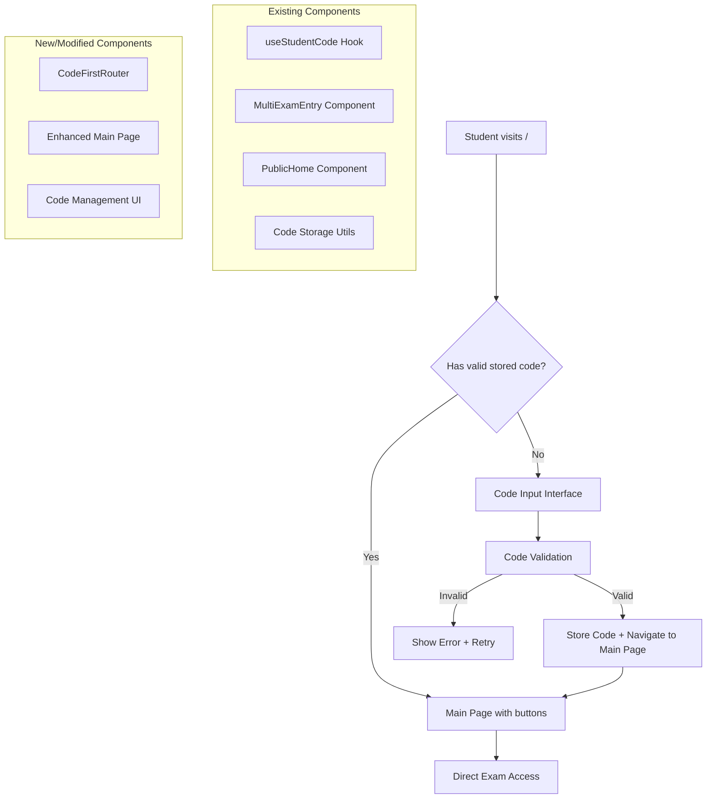
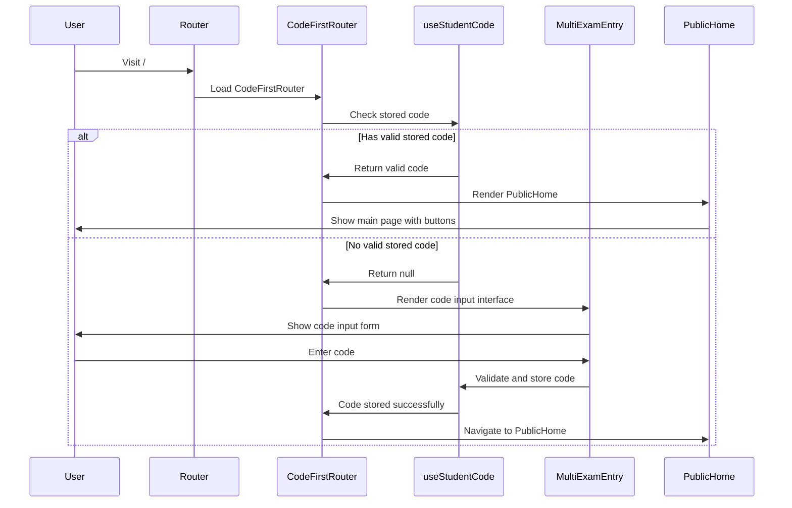

# Design Document: Student Experience Optimization

## Overview

This design optimizes the student experience by reordering the existing flow to prioritize code input and implementing persistent code storage. The solution leverages existing components and infrastructure while introducing minimal changes to achieve a streamlined student journey.

### Current Flow
1. Home page (`/`) with buttons → Exams page (`/exams`) → Code input → Exam list → Exam entry

### Optimized Flow
1. Code input (redirected from `/`) → Main page with buttons → Direct exam access

### Key Design Principles
- **Reuse Existing Components**: Leverage current `MultiExamEntry`, `PublicHome`, and `useStudentCode` implementations
- **Minimal Infrastructure Changes**: Use existing routing, API endpoints, and database schema
- **Progressive Enhancement**: Maintain backward compatibility while improving user experience
- **Performance First**: Optimize existing code paths rather than creating new ones

## Architecture

### High-Level Architecture



### Component Interaction Flow



## Components and Interfaces

### 1. CodeFirstRouter Component

**Purpose**: Orchestrates the code-first flow by determining whether to show code input or main page.

**Interface**:
```typescript
interface CodeFirstRouterProps {
  mode: "exam" | "results" | "disabled";
  disabledMessage: string | null;
  showExams: boolean;
  showResults: boolean;
  showRegister: boolean;
}

interface CodeFirstRouterState {
  hasValidCode: boolean;
  isLoading: boolean;
}
```

**Key Responsibilities**:
- Check for stored code on mount
- Validate stored code against server
- Route between code input and main page
- Handle code clearing and re-entry

### 2. Enhanced useStudentCode Hook

**Current Implementation**: Already exists with core functionality
**Enhancements Needed**:
- Add automatic validation on app startup
- Improve error handling for expired codes
- Add code format validation
- Optimize validation API calls

**Enhanced Interface**:
```typescript
interface UseStudentCodeReturn {
  storedCode: string | null;
  isValidating: boolean;
  hasValidCode: boolean; // New
  codeMetadata: StoredStudentCode | null; // New
  storeCode: (code: string, studentId?: string) => void;
  clearCode: () => void;
  validateAndRedirect: () => Promise<boolean>;
  validateCode: (code: string) => Promise<boolean>; // New
}
```

### 3. Enhanced MultiExamEntry Component

**Current Implementation**: Handles code input and exam listing
**Optimizations Needed**:
- Extract code input UI into reusable component
- Improve performance of code validation
- Add better loading states
- Optimize re-renders

**Component Structure**:
```typescript
interface MultiExamEntryProps {
  mode?: "code-only" | "full"; // New prop for different modes
  onCodeValidated?: (code: string, exams: ExamItem[]) => void; // New callback
  autoRedirect?: boolean; // New prop for controlling navigation
}
```

### 4. Enhanced PublicHome Component

**Current Implementation**: Shows main page buttons
**Enhancements Needed**:
- Add code management UI
- Show current code status
- Provide code clearing functionality

**New Props**:
```typescript
interface PublicHomeProps {
  mode: "exam" | "results" | "disabled";
  disabledMessage: string | null;
  showExams: boolean;
  showResults: boolean;
  showRegister: boolean;
  currentCode?: string; // New
  onCodeClear?: () => void; // New
}
```

### 5. Code Management UI Component

**Purpose**: Provides interface for viewing and managing stored codes

**Interface**:
```typescript
interface CodeManagementProps {
  currentCode: string;
  onClearCode: () => void;
  onChangeCode: () => void;
  compact?: boolean;
}
```

## Data Models

### Enhanced StoredStudentCode

**Current Model**:
```typescript
interface StoredStudentCode {
  code: string;
  timestamp: number;
  studentId?: string;
}
```

**Enhanced Model**:
```typescript
interface StoredStudentCode {
  code: string;
  timestamp: number;
  studentId?: string;
  lastValidated?: number; // New: Track last successful validation
  validationAttempts?: number; // New: Track failed validation attempts
  expiresAt?: number; // New: Optional expiration timestamp
  metadata?: { // New: Additional metadata
    studentName?: string;
    examCount?: number;
    lastExamId?: string;
  };
}
```

### Code Validation Response

**Interface**:
```typescript
interface CodeValidationResponse {
  valid: boolean;
  studentId?: string;
  studentName?: string;
  examCount?: number;
  expiresAt?: number;
  error?: string;
}
```

### Router State Management

**Interface**:
```typescript
interface RouterState {
  currentView: "code-input" | "main-page";
  isTransitioning: boolean;
  lastCodeCheck: number;
  validationError: string | null;
}
```

## Correctness Properties

*A property is a characteristic or behavior that should hold true across all valid executions of a system-essentially, a formal statement about what the system should do. Properties serve as the bridge between human-readable specifications and machine-verifiable correctness guarantees.*

Based on the prework analysis, the following properties ensure the reordered flow maintains correctness:

### Property 1: Code Storage Round-Trip Consistency
*For any* valid student code (non-empty and containing non-whitespace characters), storing it in browser storage and then retrieving it should produce the same code value, and the code should persist across browser sessions and crashes. Codes containing only whitespace characters are considered invalid and should not be stored.
**Validates: Requirements 2.1, 8.1, 8.2**

### Property 2: Navigation Flow Consistency  
*For any* student visiting the application, if they have a valid stored code they should bypass code input and go directly to the main page, otherwise they should be redirected to code input first.
**Validates: Requirements 1.1, 1.2, 3.1**

### Property 3: Code Validation Consistency
*For any* code input, the system should validate format before making API requests, provide real-time feedback, and handle all supported code formats correctly.
**Validates: Requirements 1.5, 9.1, 9.4, 9.5**

### Property 4: Error Handling Consistency
*For any* error condition (invalid codes, storage failures, network issues), the system should display appropriate error messages without page refresh and handle the errors gracefully across all components.
**Validates: Requirements 1.3, 2.4, 4.4, 8.3**

### Property 5: Code Invalidation and Cleanup
*For any* stored code that becomes invalid or expires, the system should automatically clear it from storage and redirect the user to code input.
**Validates: Requirements 2.3, 5.2**

### Property 6: Component State Synchronization
*For any* change in student code state, all dependent components should update reactively and receive the updated code information through the state management system.
**Validates: Requirements 4.1, 4.2**

### Property 7: Performance Preservation
*For any* user interaction in the reordered flow, the system should maintain existing performance targets (200ms render time, 300ms transitions) and minimize network requests.
**Validates: Requirements 7.1, 7.2, 7.3**

### Property 8: Accessibility and Internationalization Preservation
*For any* accessibility or internationalization feature in the original flow, the reordered flow should maintain the same level of support including ARIA labels, RTL layout, and keyboard navigation.
**Validates: Requirements 6.1, 6.2, 6.3, 6.4, 6.5**

### Property 9: Security and Audit Consistency
*For any* security-related operation (code storage, validation, logging), the system should maintain existing security measures including encryption, server verification, and audit logging.
**Validates: Requirements 5.1, 5.2, 5.3, 10.3**

### Property 10: Feature Integration Preservation
*For any* existing exam feature or integration (exam access, results, WhatsApp, IP restrictions), the reordered flow should maintain full compatibility and functionality.
**Validates: Requirements 10.1, 10.2, 10.4, 10.5**

### Property 11: Multi-User Device Support
*For any* device used by multiple students, the system should provide clear mechanisms to change codes and handle code clearing with appropriate warnings.
**Validates: Requirements 2.5, 3.2, 8.4**

### Property 12: Session and Deep Link Handling
*For any* session expiration or deep link access without valid code, the system should redirect to code input using existing session management and routing logic.
**Validates: Requirements 3.4, 3.5**

## Error Handling

### Error Categories and Strategies

**1. Code Storage Errors**
- **LocalStorage Unavailable**: Graceful degradation to session-only mode
- **Storage Quota Exceeded**: Clear old data and inform user
- **Corrupted Storage Data**: Clear invalid data and restart flow

**2. Code Validation Errors**
- **Network Failures**: Show retry options with offline indicators
- **Invalid Code Format**: Real-time validation with specific format guidance
- **Expired Codes**: Automatic cleanup and redirect to fresh code input

**3. Navigation Errors**
- **Route Not Found**: Redirect to appropriate entry point based on code status
- **Session Expired**: Clear stored data and restart authentication flow
- **Deep Link Access**: Validate code before allowing access to protected routes

**4. Component Integration Errors**
- **State Synchronization Failures**: Implement fallback state recovery
- **API Communication Errors**: Retry with exponential backoff
- **Rendering Errors**: Error boundaries with graceful fallback UI

### Error Recovery Mechanisms

```typescript
interface ErrorRecoveryStrategy {
  errorType: string;
  retryable: boolean;
  fallbackAction: () => void;
  userMessage: string;
  logLevel: "info" | "warn" | "error";
}
```

## Testing Strategy

### Dual Testing Approach

The testing strategy combines unit tests for specific scenarios with property-based tests for comprehensive coverage:

**Unit Tests Focus**:
- Specific error conditions and edge cases
- Component integration points
- Browser compatibility scenarios
- Accessibility compliance verification

**Property-Based Tests Focus**:
- Universal properties across all code inputs and user flows
- State management consistency across component updates
- Performance characteristics under various load conditions
- Security properties across different attack vectors

### Property-Based Testing Configuration

**Testing Framework**: Fast-check for TypeScript property-based testing
**Test Configuration**:
- Minimum 100 iterations per property test
- Custom generators for student codes, user sessions, and component states
- Shrinking enabled for minimal failing examples

**Property Test Tags**:
Each property test must include a comment referencing its design document property:
```typescript
// Feature: student-experience-optimization, Property 1: Code Storage Round-Trip Consistency
```

### Test Data Generation

**Code Generators**:
- Valid codes in all supported formats (numeric, alphabetic, alphanumeric, custom patterns)
- Invalid codes with various format violations
- Edge cases (empty, too long, special characters)

**User Session Generators**:
- Fresh sessions without stored codes
- Sessions with valid stored codes
- Sessions with expired/invalid stored codes
- Concurrent user sessions on same device

**Component State Generators**:
- Various application modes (exam, results, disabled)
- Different language and RTL configurations
- Multiple browser storage states
- Network connectivity scenarios

### Integration Testing

**Browser Compatibility**:
- Test across major browsers (Chrome, Firefox, Safari, Edge)
- Mobile browser testing for touch interactions
- LocalStorage behavior verification across browsers

**Performance Testing**:
- Render time measurements for code input interface
- Navigation transition timing verification
- Memory usage monitoring during extended sessions
- Network request optimization validation

**Accessibility Testing**:
- Screen reader compatibility verification
- Keyboard navigation flow testing
- ARIA label and role validation
- Color contrast and visual accessibility checks

### Security Testing

**Code Storage Security**:
- Encryption verification for stored codes
- XSS prevention in code input fields
- CSRF protection for code validation endpoints

**Session Security**:
- Session timeout handling
- Concurrent session management
- Rate limiting for code validation attempts

This comprehensive testing strategy ensures that the optimized student experience maintains reliability, security, and accessibility while improving usability through the reordered flow.