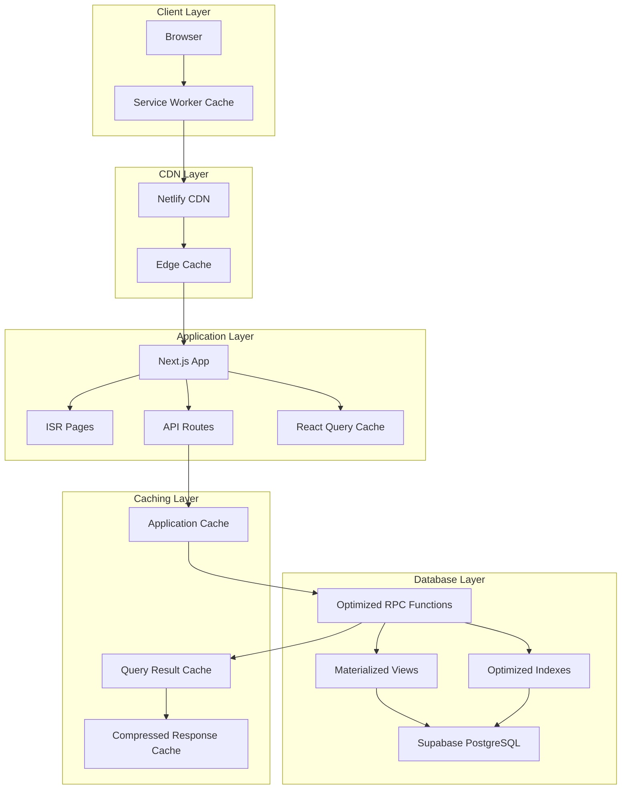
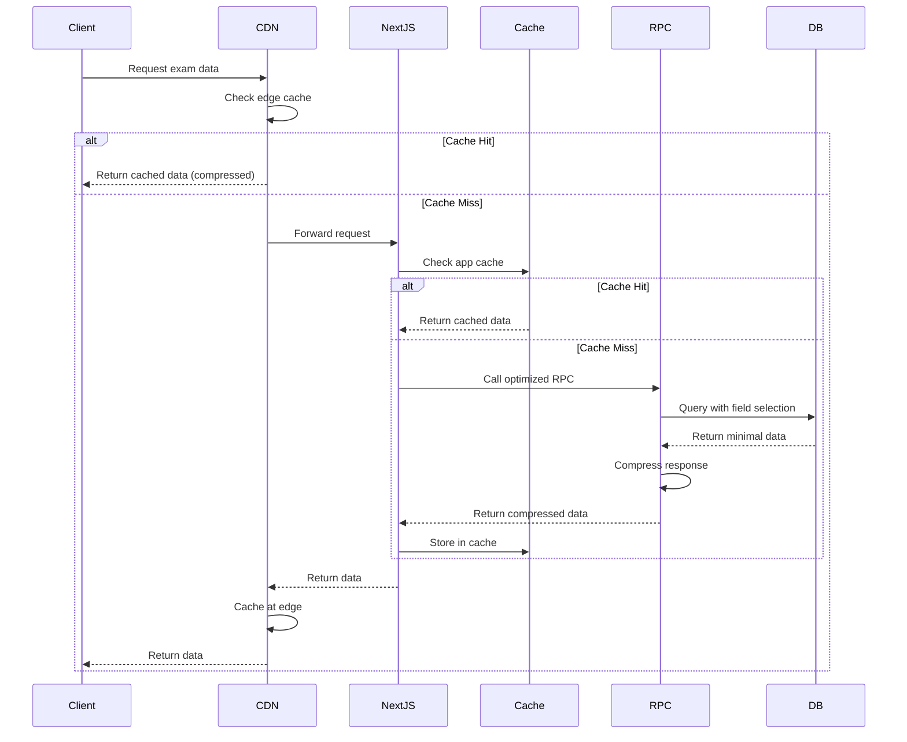

# Design Document: Supabase & Netlify Cost Optimization

## Overview

This design outlines a comprehensive optimization strategy to reduce Supabase egress bandwidth by 60% and Netlify function execution time by 50% while improving application performance. The approach combines response compression, intelligent caching, query optimization, incremental data loading, and strategic use of materialized views and indexes.

The optimization maintains backward compatibility and security while providing measurable cost savings and performance improvements for the Advanced Exam Application.

## Architecture

### High-Level Architecture



### Data Flow Optimization



## Components and Interfaces

### 1. Response Compression Module

**Purpose:** Compress RPC function responses to reduce egress bandwidth

**Interface:**
```typescript
interface CompressionModule {
  compress(data: any, encoding: 'gzip' | 'brotli'): Promise<Buffer>;
  decompress(buffer: Buffer, encoding: 'gzip' | 'brotli'): Promise<any>;
  shouldCompress(data: any): boolean; // Returns true if data > 1KB
  getCompressionRatio(original: number, compressed: number): number;
}
```

**Implementation Strategy:**
- Use Node.js `zlib` module for gzip and brotli compression
- Compress responses > 1KB automatically
- Add `Content-Encoding` header to responses
- Detect client support via `Accept-Encoding` header
- Target 60% compression ratio for JSON data

### 2. Field Selection Module

**Purpose:** Allow clients to request only needed fields from RPC functions

**Interface:**
```typescript
interface FieldSelector {
  parseFieldSelection(fields?: string[]): FieldSelection;
  applyFieldSelection(data: any, selection: FieldSelection): any;
  validateFields(fields: string[], allowedFields: string[]): boolean;
}

type FieldSelection = {
  include?: string[];
  exclude?: string[];
};
```

**Modified RPC Signatures:**
```sql
-- Enhanced get_attempt_state with field selection
CREATE OR REPLACE FUNCTION public.get_attempt_state_v2(
  p_attempt_id uuid,
  p_fields jsonb DEFAULT NULL  -- e.g., '["exam", "questions", "answers"]'
)
RETURNS jsonb;

-- Enhanced admin_list_attempts with field selection and pagination
CREATE OR REPLACE FUNCTION public.admin_list_attempts_v2(
  p_exam_id uuid,
  p_limit integer DEFAULT 50,
  p_offset integer DEFAULT 0,
  p_fields jsonb DEFAULT NULL
)
RETURNS TABLE(...);
```

### 3. Caching Layer

**Purpose:** Multi-tier caching to reduce database queries and bandwidth

**Cache Hierarchy:**

```typescript
interface CacheConfig {
  examMetadata: {
    ttl: 300; // 5 minutes
    key: (examId: string) => `exam:meta:${examId}`;
  };
  questions: {
    ttl: -1; // Infinite for published exams
    key: (examId: string) => `exam:questions:${examId}`;
  };
  studentCodes: {
    ttl: 600; // 10 minutes
    key: (code: string) => `student:code:${code}`;
  };
  ipRules: {
    ttl: 900; // 15 minutes
    key: (examId: string) => `exam:iprules:${examId}`;
  };
  appConfig: {
    ttl: 1800; // 30 minutes
    key: (key: string) => `config:${key}`;
  };
}

interface CacheLayer {
  get<T>(key: string): Promise<T | null>;
  set<T>(key: string, value: T, ttl: number): Promise<void>;
  delete(key: string): Promise<void>;
  clear(pattern: string): Promise<number>;
  getStats(): CacheStats;
}

interface CacheStats {
  hits: number;
  misses: number;
  hitRate: number;
  size: number;
  evictions: number;
}
```

**Implementation:**
- Use in-memory cache (Node.js Map) for Netlify functions
- Use React Query cache for client-side
- Implement LRU eviction policy
- Add cache warming for frequently accessed data
- Provide admin endpoint to clear cache

### 4. Materialized View for Admin Attempts

**Purpose:** Replace expensive JOIN operations in admin_list_attempts

**Schema:**
```sql
CREATE MATERIALIZED VIEW admin_attempts_summary AS
SELECT 
  a.id,
  a.exam_id,
  a.started_at,
  a.submitted_at,
  a.completion_status,
  a.ip_address,
  a.device_info,
  COALESCE(s.student_name, a.student_name) as student_name,
  s.code,
  er.score_percentage,
  er.final_score_percentage,
  COALESCE(mq.total_manual, 0) AS manual_total_count,
  COALESCE(mg.graded_manual, 0) AS manual_graded_count,
  GREATEST(COALESCE(mq.total_manual, 0) - COALESCE(mg.graded_manual, 0), 0) AS manual_pending_count
FROM public.exam_attempts a
LEFT JOIN public.students s ON s.id = a.student_id
LEFT JOIN public.exam_results er ON er.attempt_id = a.id
LEFT JOIN LATERAL (
  SELECT COUNT(*) AS total_manual
  FROM public.questions q
  WHERE q.exam_id = a.exam_id
    AND q.question_type IN ('paragraph','photo_upload')
) mq ON true
LEFT JOIN LATERAL (
  SELECT COUNT(*) AS graded_manual
  FROM public.manual_grades g
  JOIN public.questions q ON q.id = g.question_id
  WHERE g.attempt_id = a.id
    AND q.exam_id = a.exam_id
) mg ON true;

-- Create indexes on materialized view
CREATE INDEX idx_admin_attempts_summary_exam ON admin_attempts_summary(exam_id, started_at DESC);
CREATE INDEX idx_admin_attempts_summary_status ON admin_attempts_summary(exam_id, completion_status);

-- Refresh strategy: incremental refresh on attempt submission
CREATE OR REPLACE FUNCTION refresh_admin_attempts_summary_incremental(p_attempt_id uuid)
RETURNS void AS $$
BEGIN
  -- Delete old row
  DELETE FROM admin_attempts_summary WHERE id = p_attempt_id;
  
  -- Insert updated row
  INSERT INTO admin_attempts_summary
  SELECT ... FROM public.exam_attempts WHERE id = p_attempt_id ...;
END;
$$ LANGUAGE plpgsql;
```

### 5. Incremental Data Loading Module

**Purpose:** Load exam questions progressively to reduce initial load time

**Interface:**
```typescript
interface IncrementalLoader {
  loadInitialQuestions(examId: string, count: number): Promise<Question[]>;
  loadQuestionChunk(examId: string, offset: number, limit: number): Promise<Question[]>;
  prefetchNextQuestions(examId: string, currentIndex: number, count: number): Promise<void>;
  getCachedQuestions(examId: string): Question[];
}

interface Question {
  id: string;
  question_text: string;
  question_type: string;
  options?: any;
  points?: number;
  required: boolean;
  order_index: number;
  question_image_url?: string;
  option_image_urls?: any;
}
```

**Loading Strategy:**
1. Initial load: First 5 questions
2. Background prefetch: Next 3 questions
3. Chunk loading: Remaining questions in groups of 10
4. Cache all loaded questions in React Query

**Modified RPC:**
```sql
CREATE OR REPLACE FUNCTION public.get_exam_questions_paginated(
  p_exam_id uuid,
  p_offset integer DEFAULT 0,
  p_limit integer DEFAULT 5,
  p_exclude_correct_answers boolean DEFAULT true
)
RETURNS jsonb;
```

### 6. JSONB Optimization Module

**Purpose:** Reduce size of JSONB fields before storage and transfer

**Optimization Strategies:**

```typescript
interface JSONBOptimizer {
  compactAnswers(answers: Record<string, any>): Record<string, any>;
  deduplicateDeviceInfo(deviceInfo: DeviceInfo): DeviceInfo;
  createAnswerDelta(oldAnswers: any, newAnswers: any): AnswerDelta;
  applyAnswerDelta(currentAnswers: any, delta: AnswerDelta): any;
  compressActivityEvents(events: ActivityEvent[]): CompressedEvents;
}

interface AnswerDelta {
  changed: Record<string, any>;  // Only changed answers
  removed: string[];             // Removed answer IDs
  version: number;               // Delta version for ordering
}

interface DeviceInfo {
  fingerprint: string;
  allIPs: {
    local: string[];   // Deduplicated
    public: string[];  // Deduplicated
  };
  userAgent: string;
  screen: string;
  timezone: string;
}
```

**Implementation:**
- Remove whitespace from JSON before storage
- Deduplicate IP arrays in device_info
- Store answer deltas instead of full answers on auto-save
- Use integer timestamps instead of ISO strings
- Use relative paths for image URLs

### 7. React Query Configuration

**Purpose:** Optimize client-side data fetching and caching

**Configuration:**
```typescript
const queryClient = new QueryClient({
  defaultOptions: {
    queries: {
      staleTime: 30000, // 30 seconds
      cacheTime: 300000, // 5 minutes
      refetchOnWindowFocus: false,
      refetchOnReconnect: true,
      retry: 2,
      retryDelay: (attemptIndex) => Math.min(1000 * 2 ** attemptIndex, 30000),
    },
    mutations: {
      retry: 1,
      onError: (error) => {
        // Global error handling
        console.error('Mutation error:', error);
      },
    },
  },
});

// Deduplication configuration
const dedupeConfig = {
  enabled: true,
  window: 1000, // 1 second deduplication window
};

// Optimistic update configuration
const optimisticConfig = {
  onMutate: async (newData) => {
    await queryClient.cancelQueries(['attempt', attemptId]);
    const previousData = queryClient.getQueryData(['attempt', attemptId]);
    queryClient.setQueryData(['attempt', attemptId], (old) => ({
      ...old,
      ...newData,
    }));
    return { previousData };
  },
  onError: (err, newData, context) => {
    queryClient.setQueryData(['attempt', attemptId], context.previousData);
  },
  onSettled: () => {
    queryClient.invalidateQueries(['attempt', attemptId]);
  },
};
```

### 8. ISR Configuration for Exam Pages

**Purpose:** Use Incremental Static Regeneration to reduce function execution

**Configuration:**
```typescript
// app/exam/[examId]/page.tsx
export const revalidate = 60; // Revalidate every 60 seconds

export async function generateStaticParams() {
  // Pre-generate pages for published exams
  const exams = await getPublishedExams();
  return exams.map((exam) => ({
    examId: exam.id,
  }));
}

// app/attempt/[attemptId]/page.tsx
export const dynamic = 'force-dynamic'; // Always dynamic for attempt pages
```

### 9. Batch Processing Module

**Purpose:** Process multiple operations together to reduce overhead

**Interface:**
```typescript
interface BatchProcessor {
  batchCalculateResults(attemptIds: string[]): Promise<ResultSummary[]>;
  batchRefreshCache(keys: string[]): Promise<void>;
  batchLogEvents(events: ActivityEvent[]): Promise<void>;
}

// Modified RPC for batch operations
CREATE OR REPLACE FUNCTION public.batch_calculate_results(p_attempt_ids uuid[])
RETURNS TABLE(
  attempt_id uuid,
  total_questions integer,
  correct_count integer,
  score_percentage numeric,
  auto_points numeric,
  manual_points numeric,
  max_points numeric,
  final_score_percentage numeric
);
```

### 10. Performance Monitoring Module

**Purpose:** Track optimization effectiveness and identify bottlenecks

**Interface:**
```typescript
interface PerformanceMonitor {
  trackEgress(operation: string, bytes: number): void;
  trackFunctionExecution(functionName: string, duration: number): void;
  trackCacheHit(cacheType: string, hit: boolean): void;
  trackQueryTime(query: string, duration: number): void;
  getMetrics(startDate: Date, endDate: Date): PerformanceMetrics;
  generateReport(period: 'daily' | 'weekly' | 'monthly'): Report;
}

interface PerformanceMetrics {
  totalEgress: number;
  egressByOperation: Record<string, number>;
  functionExecutionTime: Record<string, number>;
  cacheHitRate: Record<string, number>;
  slowQueries: SlowQuery[];
  costEstimate: CostEstimate;
}

interface CostEstimate {
  supabaseEgress: number;
  netlifyFunctions: number;
  total: number;
  savings: number;
}
```

**Implementation:**
- Log metrics to dedicated `performance_metrics` table
- Aggregate metrics daily using scheduled job
- Provide admin dashboard for visualization
- Alert on threshold violations

## Data Models

### Enhanced Exam Attempts Table

```sql
-- Add compression metadata
ALTER TABLE public.exam_attempts 
ADD COLUMN IF NOT EXISTS answers_compressed boolean DEFAULT false,
ADD COLUMN IF NOT EXISTS device_info_compressed boolean DEFAULT false,
ADD COLUMN IF NOT EXISTS compression_ratio numeric;
```

### Performance Metrics Table

```sql
CREATE TABLE IF NOT EXISTS public.performance_metrics (
  id uuid PRIMARY KEY DEFAULT gen_random_uuid(),
  metric_type text NOT NULL, -- 'egress', 'function_execution', 'cache_hit', 'query_time'
  operation text NOT NULL,
  value numeric NOT NULL,
  metadata jsonb DEFAULT '{}'::jsonb,
  recorded_at timestamptz NOT NULL DEFAULT now()
);

CREATE INDEX idx_perf_metrics_type_time ON public.performance_metrics(metric_type, recorded_at DESC);
CREATE INDEX idx_perf_metrics_operation ON public.performance_metrics(operation, recorded_at DESC);
```

### Cache Statistics Table

```sql
CREATE TABLE IF NOT EXISTS public.cache_statistics (
  id uuid PRIMARY KEY DEFAULT gen_random_uuid(),
  cache_type text NOT NULL,
  hits integer NOT NULL DEFAULT 0,
  misses integer NOT NULL DEFAULT 0,
  evictions integer NOT NULL DEFAULT 0,
  size_bytes bigint NOT NULL DEFAULT 0,
  recorded_at timestamptz NOT NULL DEFAULT now()
);

CREATE INDEX idx_cache_stats_type_time ON public.cache_statistics(cache_type, recorded_at DESC);
```

### Optimized Indexes

```sql
-- Composite index for exam_attempts queries
CREATE INDEX IF NOT EXISTS idx_attempts_exam_status_started 
ON public.exam_attempts(exam_id, completion_status, started_at DESC);

-- Covering index for questions
CREATE INDEX IF NOT EXISTS idx_questions_exam_order_covering 
ON public.questions(exam_id, order_index) 
INCLUDE (question_text, question_type, options, points, required);

-- BRIN index for audit_logs (time-series data)
CREATE INDEX IF NOT EXISTS idx_audit_logs_created_brin 
ON public.audit_logs USING BRIN(created_at);

-- Expression index for device fingerprint
CREATE INDEX IF NOT EXISTS idx_attempts_device_fingerprint 
ON public.exam_attempts((device_info->>'fingerprint'));

-- Partial index for recent activity events
CREATE INDEX IF NOT EXISTS idx_activity_events_recent 
ON public.attempt_activity_events(attempt_id, created_at DESC)
WHERE created_at > (now() - interval '7 days');

-- Unique index with INCLUDE for student code lookups
CREATE UNIQUE INDEX IF NOT EXISTS idx_students_code_with_name 
ON public.students(code) 
INCLUDE (student_name, mobile_number);
```

## Correctness Properties

*A property is a characteristic or behavior that should hold true across all valid executions of a system—essentially, a formal statement about what the system should do. Properties serve as the bridge between human-readable specifications and machine-verifiable correctness guarantees.*


### Property Reflection

After analyzing all acceptance criteria, I've identified several areas where properties can be consolidated:

**Compression Properties (1.1, 14.1-14.7):**
- Properties 1.1 and 14.1 both test compression application - can be combined
- Properties 14.2-14.7 provide comprehensive compression testing
- Consolidate into compression property group

**Caching TTL Properties (6.1-6.5):**
- All test the same pattern: cache with specific TTL
- Can be combined into single property that tests cache TTL configuration

**Field Selection Properties (1.2, 5.4, 10.4):**
- All test field filtering/selection behavior
- Can be combined into single comprehensive property

**Batch Processing Properties (2.2, 2.7, 3.4, 5.5):**
- All test batching behavior
- Can be combined into single property about batch operations

**Index Usage Properties (15.1-15.7):**
- All are examples verifying query plans
- Keep as examples, not properties

**Broadcast Payload Properties (7.1-7.3):**
- All test subscription payload content
- Can be combined into single property about minimal payloads

**Deduplication Properties (5.2, 1.5):**
- Both test IP deduplication in device_info
- Combine into single property

**Delta Update Properties (1.6, 5.3):**
- Both test incremental updates
- Combine into single property

**Prefetching Properties (4.7, 13.2):**
- Both test prefetching behavior
- Combine into single property

After consolidation, we have approximately 45 unique testable properties and 20 examples.

### Correctness Properties

Property 1: Compression threshold and application
*For any* RPC function response, if the response size exceeds 1KB, then the response should be compressed using gzip or brotli encoding based on client Accept-Encoding header
**Validates: Requirements 1.1, 14.1**

Property 2: Compression ratio effectiveness
*For any* JSON response that is compressed, the compression ratio should be at least 60% (compressed size ≤ 40% of original size)
**Validates: Requirements 14.3**

Property 3: Compression algorithm selection
*For any* client request with Accept-Encoding header, the system should use brotli for clients supporting it, otherwise gzip, and fallback to uncompressed if compression fails
**Validates: Requirements 14.2, 14.4, 14.5**

Property 4: Compressed cache storage
*For any* cacheable compressed response, the cached version should be stored in compressed form to save cache space
**Validates: Requirements 14.6**

Property 5: Decompression error handling
*For any* decompression operation that fails, the system should handle the error gracefully without crashing
**Validates: Requirements 14.7**

Property 6: Field selection filtering
*For any* RPC function call with field selection parameter, the returned data should contain only the requested fields, and if no selection is specified, all fields should be returned by default
**Validates: Requirements 1.2, 5.4, 10.4**

Property 7: Pagination correctness
*For any* paginated query with limit and offset parameters, the number of returned records should not exceed the limit, and records should be correctly offset
**Validates: Requirements 1.3**

Property 8: Student answer security
*For any* student-facing request for exam questions, the response should never include the correct_answers field
**Validates: Requirements 1.4**

Property 9: IP deduplication in device_info
*For any* device_info object with duplicate IP addresses in allIPs arrays, the stored version should contain only unique IP addresses
**Validates: Requirements 1.5, 5.2**

Property 10: Incremental answer updates
*For any* auto-save operation, only the changed answers since the last save should be transferred, not the complete answer set
**Validates: Requirements 1.6, 5.3**

Property 11: Cache hit behavior
*For any* cacheable resource requested multiple times within its TTL period, subsequent requests should be served from cache without database queries
**Validates: Requirements 1.7, 2.3, 3.7, 6.1, 6.2, 6.3, 6.4, 6.5**

Property 12: Real-time payload minimization
*For any* real-time subscription update, only the changed fields should be included in the broadcast payload, not the complete object
**Validates: Requirements 1.8, 7.1, 7.2, 7.3**

Property 13: Batch size limits
*For any* batch processing operation, the batch size should not exceed the configured maximum (100 for cleanup_expired_attempts)
**Validates: Requirements 2.2**

Property 14: Incremental view refresh
*For any* change to underlying data of student_exam_summary view, only the affected rows should be recomputed, not the entire view
**Validates: Requirements 2.5**

Property 15: Batch calculation operations
*For any* operation that processes multiple items (regrade_exam, batch_calculate_results), items should be processed in batches rather than one-by-one
**Validates: Requirements 2.7, 3.4, 5.5**

Property 16: Response cache headers
*For any* API route response that is cacheable, appropriate Cache-Control headers should be present with correct TTL values
**Validates: Requirements 3.2**

Property 17: Request deduplication
*For any* set of identical concurrent requests made through React Query, only one network request should be executed and the result shared
**Validates: Requirements 4.1**

Property 18: Virtual scrolling activation
*For any* list with more than 50 items, virtual scrolling should be enabled to render only visible items
**Validates: Requirements 4.3**

Property 19: Optimistic update behavior
*For any* mutation operation, the UI should update immediately with the expected result before server confirmation
**Validates: Requirements 4.4**

Property 20: Auto-save debouncing
*For any* sequence of auto-save triggers within 3 seconds, only one save request should be sent to the server
**Validates: Requirements 4.5**

Property 21: Question prefetching
*For any* currently displayed question, the next 3 questions should be prefetched in the background
**Validates: Requirements 4.7, 13.2**

Property 22: Compact JSON encoding
*For any* JSON data stored in JSONB fields (answers, device_info, auto_save_data), the stored representation should have no unnecessary whitespace
**Validates: Requirements 5.1**

Property 23: Integer timestamp usage
*For any* progress_data stored, timestamps should be represented as integer Unix timestamps, not ISO 8601 strings
**Validates: Requirements 5.6**

Property 24: Relative URL paths
*For any* image URL stored in option_image_urls, the stored path should be relative, not absolute
**Validates: Requirements 5.7**

Property 25: Cursor-based pagination
*For any* audit log query, cursor-based pagination should be used instead of offset-based pagination to avoid table scans
**Validates: Requirements 6.6**

Property 26: Monitoring subscription throttling
*For any* exam with real-time monitoring active, broadcast updates should be throttled to maximum 1 per second
**Validates: Requirements 7.5**

Property 27: Shared subscription channels
*For any* exam being monitored by multiple administrators, they should share the same subscription channel to reduce database load
**Validates: Requirements 7.6**

Property 28: Automatic unsubscribe on inactivity
*For any* monitoring subscription inactive for 5 minutes, the system should automatically unsubscribe
**Validates: Requirements 7.7**

Property 29: Function execution time logging
*For any* Netlify function execution, the execution time should be logged for performance monitoring
**Validates: Requirements 9.2**

Property 30: Slow query logging
*For any* database query taking longer than 1 second, the query should be logged as a slow query
**Validates: Requirements 9.3**

Property 31: Cache hit rate tracking
*For any* cache type, the hit rate (hits / (hits + misses)) should be tracked and available for monitoring
**Validates: Requirements 9.4**

Property 32: Response time percentile calculation
*For any* API endpoint, response time percentiles (p50, p95, p99) should be calculated and logged
**Validates: Requirements 9.5**

Property 33: Error rate tracking
*For any* error that occurs, the error type and rate should be logged for monitoring
**Validates: Requirements 9.6**

Property 34: Performance threshold alerting
*For any* performance metric that exceeds its configured threshold, an alert should be sent to administrators
**Validates: Requirements 9.7**

Property 35: Function signature compatibility
*For any* modified RPC function, the original function signature should still be supported for backward compatibility
**Validates: Requirements 10.1**

Property 36: Legacy endpoint functionality
*For any* legacy endpoint, it should remain functional for at least 30 days after a new optimized endpoint is introduced
**Validates: Requirements 10.2**

Property 37: Uncompressed data handling
*For any* legacy uncompressed data encountered, the system should detect and handle it correctly alongside compressed data
**Validates: Requirements 10.5**

Property 38: Single-item batch compatibility
*For any* batch processing function, it should correctly handle single-item inputs for backward compatibility
**Validates: Requirements 10.7**

Property 39: Cache key role isolation
*For any* cached data, the cache key should include the user role to prevent cross-role cache access
**Validates: Requirements 11.3**

Property 40: Sensitive field exclusion from cache
*For any* cached data, sensitive fields (password_hash, JWT secrets) should never be included
**Validates: Requirements 11.4**

Property 41: Secure cache deletion
*For any* expired cache entry, the data should be securely deleted, not just marked as expired
**Validates: Requirements 11.5**

Property 42: IP address hashing in cache keys
*For any* cache key that includes an IP address, the IP should be hashed for privacy
**Validates: Requirements 11.6**

Property 43: Audit log cache TTL limit
*For any* cached audit log data, the cache TTL should not exceed 1 minute for compliance
**Validates: Requirements 11.7**

Property 44: Egress categorization
*For any* bandwidth consumed, it should be categorized by operation type (RPC, real-time, storage) for cost tracking
**Validates: Requirements 12.4**

Property 45: Cache bandwidth savings calculation
*For any* cache hit, the bandwidth saved should be calculated and tracked for ROI measurement
**Validates: Requirements 12.5**

Property 46: Cost threshold alerting
*For any* cost metric that exceeds budget limits, an alert should be sent to administrators
**Validates: Requirements 12.7**

Property 47: Question chunk loading
*For any* exam with more than 10 questions, questions beyond the initial 5 should be loaded in chunks of 10
**Validates: Requirements 13.4**

Property 48: Current question priority
*For any* slow network condition, loading the current question should be prioritized over prefetching next questions
**Validates: Requirements 13.5**

Property 49: Resume last answered question
*For any* exam resume operation, the last answered question should be loaded first before other questions
**Validates: Requirements 13.6**

Property 50: Offline question caching
*For any* exam where all questions have been loaded, the complete question set should be cached for offline access
**Validates: Requirements 13.7**

Property 51: Lazy image loading
*For any* question image below the viewport fold, the image should not be loaded until it's about to become visible
**Validates: Requirements 13.3**

Property 52: Monitoring summary statistics
*For any* monitoring dashboard load, summary statistics should be fetched instead of individual attempt records
**Validates: Requirements 7.4**

## Error Handling

### Compression Errors
- **Compression Failure**: If compression fails, fallback to uncompressed response with warning log
- **Decompression Failure**: If decompression fails, return error to client with appropriate status code
- **Unsupported Encoding**: If client requests unsupported encoding, use gzip as default

### Cache Errors
- **Cache Miss**: On cache miss, fetch from database and populate cache
- **Cache Corruption**: If cached data is corrupted, invalidate cache entry and refetch
- **Cache Full**: Implement LRU eviction when cache reaches capacity limit
- **Cache Timeout**: If cache operation times out, proceed without cache

### Database Errors
- **Query Timeout**: If query exceeds timeout, log as slow query and return error
- **Connection Pool Exhausted**: Queue requests and retry with exponential backoff
- **Materialized View Stale**: If view is stale, trigger refresh and retry query
- **Index Missing**: If expected index is missing, log warning and use table scan

### Network Errors
- **Request Timeout**: Retry with exponential backoff up to 3 attempts
- **Connection Refused**: Return error to client with retry-after header
- **Rate Limit Exceeded**: Return 429 status with retry-after header
- **Bandwidth Limit**: Throttle requests and queue for later processing

### Data Validation Errors
- **Invalid Field Selection**: Return error with list of valid fields
- **Invalid Pagination Parameters**: Return error with valid parameter ranges
- **Invalid Compression Ratio**: Log warning and proceed with actual ratio
- **Invalid Cache TTL**: Use default TTL and log warning

## Testing Strategy

### Dual Testing Approach

This optimization requires both unit tests and property-based tests for comprehensive coverage:

**Unit Tests** focus on:
- Specific compression scenarios (empty data, large data, already compressed)
- Cache configuration and TTL values
- Error handling paths (compression failure, cache corruption)
- Integration points (React Query, Supabase client)
- Edge cases (single-item batches, empty field selection)

**Property-Based Tests** focus on:
- Universal compression behavior across all data sizes
- Cache correctness across all TTL configurations
- Field selection across all possible field combinations
- Pagination correctness across all offset/limit combinations
- Batch processing across all batch sizes

### Property-Based Testing Configuration

**Library Selection:**
- TypeScript/JavaScript: Use `fast-check` library
- SQL/Database: Use `pgTAP` for PostgreSQL testing
- Minimum 100 iterations per property test

**Test Tagging Format:**
Each property test must include a comment referencing the design property:
```typescript
// Feature: supabase-netlify-optimization, Property 1: Compression threshold and application
test('compression is applied to responses > 1KB', async () => {
  await fc.assert(
    fc.asyncProperty(
      fc.jsonValue(),
      async (data) => {
        const response = await compressResponse(data);
        const size = JSON.stringify(data).length;
        if (size > 1024) {
          expect(response.compressed).toBe(true);
        } else {
          expect(response.compressed).toBe(false);
        }
      }
    ),
    { numRuns: 100 }
  );
});
```

### Test Organization

```
tests/
├── unit/
│   ├── compression.test.ts
│   ├── caching.test.ts
│   ├── field-selection.test.ts
│   ├── pagination.test.ts
│   └── batch-processing.test.ts
├── property/
│   ├── compression.property.test.ts
│   ├── caching.property.test.ts
│   ├── field-selection.property.test.ts
│   ├── pagination.property.test.ts
│   └── batch-processing.property.test.ts
├── integration/
│   ├── end-to-end-optimization.test.ts
│   ├── cache-invalidation.test.ts
│   └── performance-monitoring.test.ts
└── database/
    ├── materialized-views.test.sql
    ├── indexes.test.sql
    └── rpc-functions.test.sql
```

### Performance Testing

**Baseline Metrics** (before optimization):
- Measure current Supabase egress over 7 days
- Measure current Netlify function execution time
- Measure current page load times
- Measure current cache hit rates (if any)

**Target Metrics** (after optimization):
- 60% reduction in Supabase egress
- 50% reduction in Netlify function execution time
- 40% improvement in page load times
- 80%+ cache hit rate for frequently accessed data

**Load Testing:**
- Simulate 100 concurrent exam attempts
- Simulate 50 concurrent admin monitoring sessions
- Simulate 1000 questions per exam
- Measure performance under load

### Monitoring and Alerting

**Key Metrics to Monitor:**
- Supabase egress (GB/day)
- Netlify function execution time (seconds/day)
- Cache hit rate (%)
- Compression ratio (%)
- Query execution time (ms)
- Error rate (%)

**Alert Thresholds:**
- Egress exceeds 80% of budget
- Function execution time exceeds 80% of budget
- Cache hit rate drops below 70%
- Compression ratio drops below 50%
- Query time exceeds 1 second
- Error rate exceeds 1%

## Implementation Notes

### Phased Rollout

**Phase 1: Foundation (Week 1-2)**
- Implement compression module
- Add performance metrics table
- Create caching layer infrastructure
- Add field selection to RPC functions

**Phase 2: Database Optimization (Week 3-4)**
- Create materialized views
- Add optimized indexes
- Implement batch processing
- Optimize RPC functions

**Phase 3: Frontend Optimization (Week 5-6)**
- Configure React Query
- Implement incremental loading
- Add virtual scrolling
- Optimize bundle size

**Phase 4: Monitoring & Tuning (Week 7-8)**
- Deploy performance monitoring
- Analyze metrics
- Tune cache TTLs
- Optimize compression thresholds

### Rollback Strategy

- Keep original RPC functions alongside optimized versions
- Use feature flags to enable/disable optimizations
- Maintain original tables when creating materialized views
- Keep uncompressed data alongside compressed for 30 days
- Monitor error rates and rollback if they exceed 2%

### Security Considerations

- Encrypt cached sensitive data at rest
- Hash IP addresses in cache keys
- Isolate admin and student caches
- Audit cache access patterns
- Implement cache poisoning prevention
- Validate all field selection inputs
- Sanitize all compression inputs

### Performance Targets

**Supabase Egress Reduction:**
- Compression: 40% reduction
- Field selection: 10% reduction
- Caching: 8% reduction
- Incremental loading: 2% reduction
- Total: 60% reduction

**Netlify Function Time Reduction:**
- ISR: 30% reduction
- Caching: 15% reduction
- Batch processing: 5% reduction
- Total: 50% reduction

**User Experience Improvements:**
- Initial page load: 40% faster
- Exam start time: 60% faster
- Auto-save latency: 70% reduction
- Monitoring refresh: 50% faster
